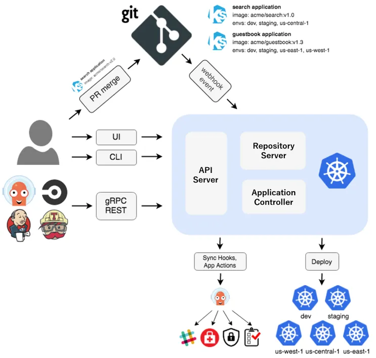

+++
date = '2026-10-10T09:33:28+08:00'
draft = false
title = 'ArgoCD 入门和生产实践指南'
categories = ['DevOps']
tags = ['ArgoCD', 'GitOps', 'K8s', 'CICD']
+++

# 1. 什么是 ArgoCD

[ArgoCD](https://argo-cd.readthedocs.io/en/stable/) 是 CNCF 毕业级项目，面向 Kubernetes 的**声明式 GitOps 持续交付工具**。

GitOps 核心思想：**Git 仓库作为应用配置的唯一可信源**。ArgoCD 持续监听 Git 仓库内定义的应用目标状态，对比集群内资源的实际运行状态，自动完成应用部署、版本更新与故障回滚。

ArgoCD 原生支持多种配置编排方式：Helm Chart、Kustomize、Jsonnet、Ksonnet，以及原生 YAML/JSON Kubernetes 资源清单。

# 2. 架构原理

ArgoCD 以 Kubernetes 控制器形态运行，持续对应用做状态巡检：

1. 拉取 Git 仓库中声明的**期望状态（Target State）**
2. 采集集群内资源**实际运行状态（Live State）**
3. 对比两者差异，不一致时标记为 `OutOfSync`（不同步）
4. 可视化展示资源差异，支持**手动同步 / 自动同步**，将集群状态收敛到 Git 定义的目标状态

Git 仓库中修改清单后，ArgoCD 会感知变更并同步至目标集群，实现“改 Git 即发布”。

具体工作流程参见下面的图片：


**核心组件**:

| 组件 | 核心作用 |
| :---: | :---: |
| `argocd-server` | ArgoCD API 服务，提供 REST API、Web UI，处理认证鉴权 |
| `argocd-repo-server` | Git 仓库管理服务，缓存仓库代码、渲染 Helm/Kustomize 生成K8s清单 |
| `argocd-application-controller` | 应用控制器，持续做状态比对，执行同步、健康检查 |
| `argocd-applicationset-controller` | ApplicationSet控制器，批量、模板化管理多环境/多集群 Application |
| `argocd-redis` | 缓存组件，存储仓库缓存、应用状态信息 |
| `argocd-dex-server` | 可选，Dex 身份代理，对接OIDC、LDAP等外部身份源 |
| `argocd-notifications-controller` | 可选，通知控制器，同步状态变更推送至邮件、Slack、Webhook等 |

# 3. 部署
部署前建议查阅[官方版本兼容矩阵](https://argo-cd.readthedocs.io/en/stable/operator-manual/installation/#supported-versions)，选择与K8s集群匹配的ArgoCD版本。

## 3.1 YAML 清单直接部署
```bash
# 下载官方安装清单（示例v2.3.5，按需替换版本）
wget "https://raw.githubusercontent.com/argoproj/argo-cd/v2.3.5/manifests/install.yaml"

# 创建命名空间
kubectl create namespace argocd

# 部署ArgoCD资源
kubectl apply -f install.yaml -n argocd
```

## 3.2 Helm Chart 部署（生产推荐）

### 3.2.1 添加 Helm 仓库

```bash
# 添加Argo官方Chart仓库
helm repo add argo "https://argoproj.github.io/argo-helm"

# 更新仓库索引
helm repo update

# 查询所有可用Chart版本
helm search repo argo/argo-cd -l

# 下载Chart包到本地
helm pull argo/argo-cd --untar
```

### 3.2.2 自定义 values.yaml
```yaml
global:
  domain: argocd.wuvikr.top # ArgoCD访问域名
server:
  # 生产环境推荐ClusterIP，通过Ingress对外暴露
  service:
    type: ClusterIP
  ingress:
    enabled: true
    ingressClassName: "nginx"
    hostname: argocd.wuvikr.top
    annotations:
      nginx.ingress.kubernetes.io/force-ssl-redirect: "true"
      nginx.ingress.kubernetes.io/backend-protocol: "HTTPS"
    tls: true
    # 已有证书Secret可启用下面配置
    # extraTls:
    # - hosts:
    #   - argocd.example.com
    #   secretName: argocd-tls
  # Ingress层完成TLS终结时开启
  extraArgs:
    - --insecure

configs:
  secret:
    # 可预先设置admin密码BCrypt哈希，留空自动生成
    # argocdServerAdminPassword: ""
    # argocdServerAdminPasswordMtime: ""
  # 私有Git仓库配置示例
  repositories:
    private-repo:
      url: https://git.example.com/org/repo.git
      passwordSecret:
        name: repo-secret
        key: password
      usernameSecret:
        name: repo-secret
        key: username

# Redis持久化，生产环境必须开启
redis:
  persistence:
    enabled: true
    size: 10Gi
    storageClass: "your-storage-class"

# 开启通知控制器
notifications:
  enabled: true

controller:
  args:
    appResyncPeriod: "180" # 全量状态巡检周期(秒)，默认180s
```

### 3.2.3 执行安装

```bash
helm install argocd argo/argo-cd \
  --namespace argocd \
  --create-namespace \
  --values values.yaml
```

## 3.3 获取 Admin 初始密码
默认管理员账号：`admin`
```bash
# 方式1：从Secret解析密码
kubectl -n argocd get secret argocd-initial-admin-secret -o jsonpath="{.data.password}" | base64 -d && echo

# 方式2：argocd CLI获取
argocd admin initial-password -n argocd
```

## 3.4 Ingress 配置（Nginx Ingress）
```yaml
apiVersion: networking.k8s.io/v1
kind: Ingress
metadata:
  name: argocd-server-ingress
  namespace: argocd
  annotations:
    cert-manager.io/cluster-issuer: letsencrypt-prod
    kubernetes.io/tls-acme: "true"
    nginx.ingress.kubernetes.io/ssl-passthrough: "true"
    # 出现307重定向循环时，启用下面注解，Ingress后端使用HTTPS协议访问argocd-server
    nginx.ingress.kubernetes.io/backend-protocol: "HTTPS"
spec:
  ingressClassName: "nginx"
  rules:
    - host: argocd.wuvikr.top
      http:
        paths:
          - path: /
            pathType: Prefix
            backend:
              service:
                name: argocd-server
                port:
                  name: https
  tls:
    - hosts:
        - argocd.wuvikr.top
      secretName: argocd-secret # ArgoCD内置Secret，不要修改名称
```
> [!TIP] 提示：
> 如果 Ingress 注解配置错误，会引发 Dex 跳转异常、307 重定向死循环。


## 3.4 ArgoCD 客户端 CLI

[Github 下载地址](https://github.com/argoproj/argo-cd/releases)
[官方安装文档](https://argo-cd.readthedocs.io/en/stable/cli_installation/)

```bash
# github 下载
wget "https://github.com/argoproj/argo-cd/releases/latest/download/argocd-linux-amd64"
# 国内镜像加速
wget "https://gh-proxy.org/https://github.com/argoproj/argo-cd/releases/latest/download/argocd-linux-amd64"

# 赋予执行权限并放入PATH
chmod +x argocd-linux-amd64
mv argocd-linux-amd64 /usr/local/bin/argocd

# 登录ArgoCD服务端
argocd login argocd.wuvikr.top --username admin --password 'YWDGJ0GLYGNfLynq'

# 修改admin密码（生产必做）
argocd account update-password
```
**常用 CLI 命令**:

```bash
# 查看已接入集群列表
argocd cluster list

# 添加目标集群到ArgoCD管理
argocd cluster add

# 添加SSH协议私有Git仓库
argocd repo add git@gitlab.com:wuvikr-devops/argoapp.git \
  --insecure-ignore-host-key \
  --ssh-private-key-path /root/.ssh/id_rsa
```

# 4. GitOps 实战案例：部署Nginx应用
Git 仓库存放 Kustomize 清单，ArgoCD 自动同步到 K8s 集群。

## 4.1 仓库目录结构（Git仓库）

```bash
argo-apps/
└── nginx/
    ├── kustomization.yaml
    ├── deployment.yaml
    └── service.yaml
```

`kustomization.yaml`:

```yaml
apiVersion: kustomize.config.k8s.io/v1beta1
kind: Kustomization
resources:
  - deployment.yaml
  - service.yaml
```

`deployment.yaml`:

```yaml
apiVersion: apps/v1
kind: Deployment
metadata:
  name: nginx-demo
  namespace: demo
spec:
  replicas: 2
  selector:
    matchLabels:
      app: nginx-demo
  template:
    metadata:
      labels:
        app: nginx-demo
    spec:
      containers:
      - name: nginx
        image: harbor.wuvikr.top/k8s/nginx:1.25
        ports:
        - containerPort: 80
```

`service.yaml`:

```yaml
apiVersion: v1
kind: Service
metadata:
  name: nginx-demo
  namespace: demo
spec:
  selector:
    app: nginx-demo
  ports:
  - port: 80
    targetPort: 80
  type: ClusterIP
```

## 4.2 创建 ArgoCD Application CR
```yaml
apiVersion: argoproj.io/v1alpha1
kind: Application
metadata:
  name: nginx-demo
  namespace: argocd
spec:
  # 目标集群与命名空间
  destination:
    server: https://kubernetes.default.svc
    namespace: demo
  # 源：Git仓库地址与路径
  source:
    repoURL: git@gitlab.com:wuvikr-devops/argoapp.git
    targetRevision: main
    path: nginx
  # 同步策略
  syncPolicy:
    automated:
      prune: true # 删除Git中移除的资源
      selfHeal: true # 集群资源被手动篡改，自动修复回Git状态
    syncOptions:
      - CreateNamespace=true # 不存在命名空间则自动创建
```

应用部署命令：
```bash
kubectl apply -f nginx-app.yaml

# 查看应用状态
argocd app get nginx-demo

# 手动触发同步
argocd app sync nginx-demo
```
测试流程：修改 Git 仓库内 deployment 镜像版本，提交推送 → ArgoCD 检测变更 → 自动滚动更新集群 Nginx。

回滚：Git仓库恢复旧版本清单提交，ArgoCD自动回滚，或者CLI执行 `argocd app rollback nginx-demo`

# 5. ArgoCD 完整 GitOps 流水线 CICD 实战

## 5.1 流水线设计
整体设计分为 CI 和 CD 两个阶段，**CI 阶段负责构建、安全扫描、镜像推送；ArgoCD 只负责 K8s 资源的部署与状态收敛**。不推荐 ArgoCD 去拉取镜像做构建，职责分离，便于安全管控与排障。

整体架构如下所示：
```plaintext
开发提交代码（Git 业务仓库）
        ↓
【CI阶段】
拉取代码 → 构建镜像 → Trivy 镜像漏洞扫描
        ├─ 漏洞不通过 → 流水线终止、告警
        └─ 扫描通过 → 推送镜像至 Harbor 私有仓库 → CI 自动更新 GitOps 仓库内K8s清单镜像Tag
        ↓
【CD阶段】
ArgoCD 感知 Git变更 → 比对集群状态 → 同步部署到 K8s 集群 → 推送部署结果通知
```

## 5.2 流水线关键规则

1. 镜像必须推送到私有 Harbor 仓库，禁止直接使用外网公共镜像；
2. CI 阶段 Trivy 漏洞扫描作为门禁，扫描出高危漏洞直接阻断流水线，不允许推送到 Harbor；
3. 代码和 K8s 清单分别保存在独立 Git 仓库（配置仓库和业务代码仓库分离）；
4. CI 更新镜像 Tag 后提交 MR，人工评审合并，合并后 ArgoCD 才感知变更。

## 5.3 GitLab CI 示例（业务代码仓库）
`.gitlab-ci.yml`：
```yaml
stages:
  - build
  - scan
  - push
  - update-manifest

variables:
  HARBOR_REGISTRY: harbor.wuvikr.top
  HARBOR_PROJECT: k8s
  IMAGE_NAME: nginx-demo
  IMAGE_TAG: $CI_COMMIT_SHORT_SHA
  FULL_IMAGE: $HARBOR_REGISTRY/$HARBOR_PROJECT/$IMAGE_NAME:$IMAGE_TAG

build:
  stage: build
  image: docker:24
  services:
    - docker:24-dind
  script:
    - docker login $HARBOR_REGISTRY -u $HARBOR_USER -p $HARBOR_PWD
    - docker build -t $FULL_IMAGE .

trivy-scan:
  stage: scan
  image: aquasec/trivy:latest
  script:
    - trivy image --severity HIGH,CRITICAL --exit-code 1 $FULL_IMAGE
  # 存在高危/严重漏洞直接退出，阻断流水线

push-image:
  stage: push
  image: docker:24
  services:
    - docker:24-dind
  script:
    - docker login $HARBOR_REGISTRY -u $HARBOR_USER -p $HARBOR_PWD
    - docker push $FULL_IMAGE

update-git-manifest:
  stage: update-manifest
  image: bitnami/git:latest
  script:
    # 克隆配置仓库
    - git clone git@gitlab.com:wuvikr-devops/argoapp.git
    - cd argoapp/nginx
    # 使用yq修改deployment镜像tag
    - yq eval ".spec.template.spec.containers[0].image = \"$FULL_IMAGE\"" deployment.yaml -i
    - git config user.name "ci-bot"
    - git config user.email "ci@wuvikr.top"
    - git add deployment.yaml
    - git commit -m "CI auto update image tag: $IMAGE_TAG"
    - git push
```

> [!NOTE] 备注：
> - 配置仓库权限，给 CI 机器人账号配置 SSH 密钥，**仅允许提交 Tag 变更，不允许删除资源**；
> - 生产环境建议改成提交MR（Merge Request），**人工审核后合并，而不是直接push main 分支**。

## 5.4 流水线验证流程
1. 开发提交业务代码，触发 GitLab CI；
2. CI 构建镜像，Trivy 扫描，漏洞不达标直接失败告警；
3. 扫描通过，镜像推送到 Harbor；
4. CI 机器人自动修改 GitOps 配置仓库内的 Deployment 镜像版本并提交；
5. ArgoCD 轮询 Git 仓库，检测镜像 tag 变更；
6. ArgoCD 同步应用，集群滚动更新 Pod；
7. 同步成功/失败，通过 argocd-notifications 推送告警。

# 6. 生产环境最佳实践

1. **权限安全**：
   - 禁用 admin 账号日常使用，对接 Dex+OIDC/LDAP，基于 RBAC 分配权限；
   - ArgoCD ServiceAccount 最小权限原则，不要给 cluster-admin；
   - 私有 Git 仓库使用 SSH 密钥或者 Secret 凭证，禁止明文密码写在 yaml。
2. **同步策略规范**：
   - 生产环境**不建议直接开启自动同步**，可使用手动同步+人工评审；测试环境开启`automated`；
   - `prune=true`谨慎开启，开启后Git删除资源会同步删除集群资源；
   - 设置合理的`appResyncPeriod`，不要过小，避免频繁API请求压集群。
3. **镜像与仓库**：
   - 镜像统一推送到私有 Harbor 仓库，清单内全部使用 Harbor 内网地址；
   - 遵循 GitOps 最佳实践，将应用源码仓库与 Kubernetes 清单配置仓库分开，互不影响。
4. **流水线逻辑**：推荐使用 GitOps 分层模型，即 **CI负责构建 + 镜像扫描，ArgoCD 负责部署**；
4. **高可用与存储**：
   - 生产部署使用 HA 模式，多副本argocd-server、application-controller；
   - Redis 必须开启持久化，使用集群可用 StorageClass，防止缓存丢失；
   - ArgoCD 数据库定期备份。
5. **告警与可观测**：
   - 开启`argocd-notifications`，应用OutOfSync、同步失败推送告警；
   - 接入Prometheus采集ArgoCD指标，Grafana配置大盘监控同步状态；
   - 所有变更保留Git提交记录，审计追溯发布历史。
6. **多环境管理**
   - 推荐使用`ApplicationSet`做多环境（dev/test/prod）批量管理，避免重复编写大量Application资源；
   - 环境隔离：不同环境使用独立K8s命名空间或独立集群，Git仓库目录按环境划分。

# 7. 常见坑点
1. 私有 Git 仓库拉取失败：检查 repo-server 容器内 SSH 密钥、 known_host 配置；
2. 资源被人为修改后不会自动恢复：需要开启`selfHeal: true`；
3. 清单渲染报错：检查 repo-server 权限， Kustomize/Helm 版本兼容性；


# 参考链接

1. ArgoCD 官方文档：https://argo-cd.readthedocs.io/en/stable/
2. ArgoCD Helm Chart：https://github.com/argoproj/argo-helm
3. GitOps 官方原则：https://opengitops.dev/
4. Trivy 官方文档：https://aquasecurity.github.io/trivy/
