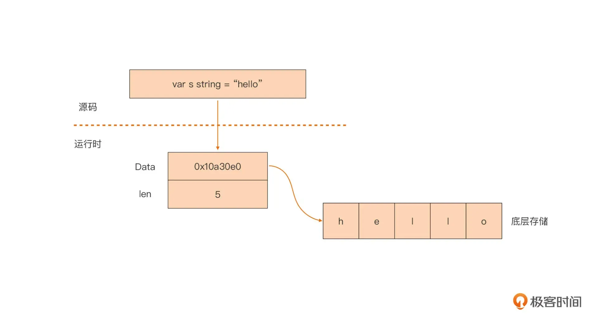

+++
date = '2026-09-25T10:01:44+08:00'
draft = false
title = 'Go 语言中的字符串类型'
categories = ['编程']
tags = ['Go', '基础知识', 'String', '变量']
+++

Go 原生支持字符串类型，关键字`string`用于表示字符串数据类型。

# 1. 底层实现
Go 中的`string`实际上是一个`struct`类型，其本身并不真正存储字符串数据，仅是由一个指向底层数组的指针和字符串的长度字段组成，可以在标准库的`reflect`包中，找到下面代码：
```go
// $GOROOT/src/reflect/value.go

// StringHeader是一个string的运行时表示
type StringHeader struct {
    Data uintptr
    Len int
}
```
由于`string`类型实际上只是一个对底层存储的引用，因此实际传参的开销非常小，另外在生成`string`变量时，会同时存储字节长度`len`，所以无论字符串长度怎么变化，获取长度的时间都是`O(1)`。

**底层实现图解**：



**三个必须记住的特性**：
| 特性       | 含义                        |
| -------- | ------------------------- |
| 不可变      | 任何“修改”操作都会产生新字符串，原串不变     |
| UTF-8 编码 | 源码中的字符串字面量默认是 UTF-8       |
| 零值是 `""` | 不是 nil，`var s string` 是空串 |

```go
var s string = "Hello"
// s[0] = 'h'        // 编译错误：cannot assign to s[0]
b := []byte(s)       // 想修改就转成切片（会复制一份）
```

>注意：`len(s)`返回的是字节数，不是字符数。中文、emoji 等多字节字符会让两者不相等。


# 2. 字面量与引号
Go 中初始化字符串变量，需要在双引号`"`中定义值，单引号`'`用于单个字符（ 以及 runes  ）。

```go
var Name string = "zhangsan"
age := "18"
var a char = 'a'

s1 := "hello\nworld"   // 双引号：支持 \n \t \" \\ 等转义
// 输出：
// hello
// world

s2 := `hello\nworld`   // 反引号（原生字符串）：原样保留
// 输出：
// hello\nworld

s3 := ""        // 空串，len == 0
```
Go 中没有也不支持三引号的写法，使用反引号来表示原生字面量。由于所见即所得，原样保留，可跨行的特点，常用于`SQL/JSON/正则表达式`中
```go
// 双引号版：要写一堆 \\ 来转义
re := "\\d{4}-\\d{2}-\\d{2}"

// 反引号版：所见即所得
re := `\d{4}-\d{2}-\d{2}`

path := `C:\Users\admin\docs`
```

# 3. 字符串常见操作
## 3.1 拼接字符串
```go
a := "hello"
b := "world"

// + 号，最简单的拼接方式
c := a + ", " + b

// 格式化拼接，支持任意类型
c = fmt.Sprintf("%s, %s", a, b) 

// 大量拼接推荐使用 strings.Builder（避免反复分配内存）
var sb strings.Builder
sb.WriteString(a)
sb.WriteString(", ")
sb.WriteString(b)
c = sb.String()
```

## 3.2 索引与切片
```go
s := "hello"
fmt.Println(s[0])            // 104（byte 值 'h'），不是字符串！
fmt.Println(string(s[0]))    // "h"

fmt.Println(s[1:4])          // "ell"  左闭右开
fmt.Println(s[:2])           // "he"
fmt.Println(s[3:])           // "lo"
fmt.Println(s[:])            // "hello"（不分配新内存，共享底层数组）
```
Go 中的切片操作不会复制数据，只是新建一个`header`，所以非常高效。但需要注意的是，对多字节字符按字节切分会得到乱码。

## 3.3 遍历
```go
s := "Hi 你"

// for range：按 rune（Unicode 码点）遍历，i 是字节下标
for i, r := range s {
    fmt.Printf("%d %q\n", i, r)
}
/* 输出：
0 'H'
1 'i'
2 ' '
3 '你'
*/


// 传统 for：按字节遍历
for i := 0; i < len(s); i++ {
    fmt.Printf("%d %d\n", i, s[i])
}
/* 输出：
0 72
1 105
2 32
3 228
4 189
5 160
*/
```

## 3.4 常用判断与转换
```go
s := "  Hello World  "

strings.Contains(s, "World")     // true     是否包含
strings.HasPrefix(s, "He")       // false    前缀（注意有空格）
strings.HasSuffix(s, "ld")       // true     后缀
strings.Count(s, "l")            // 3        出现次数
strings.Index(s, "World")        // 8        首次出现位置，没有返回 -1
strings.LastIndex(s, "l")        // 9

strings.ToLower(s)               // "  hello world  "
strings.ToUpper(s)               // "  HELLO WORLD  "
strings.TrimSpace(s)             // "Hello World"
strings.Trim(s, " Hd")           // "ello Worl"   掐掉首尾指定字符集
strings.ReplaceAll(s, "l", "L")  // "  HeLLo WorLd  "
strings.Split("a,b,c", ",")      // []string{"a","b","c"}
strings.Join([]string{"a","b"}, "-") // "a-b"
strings.Repeat("ab", 3)          // "ababab"
strings.Fields(" a  b c ")       // []string{"a","b","c"}  按空白切分
```

## 3.5 与其他类型互转
```go
// string <-> []byte
b := []byte("abc")
s := string(b)

// string <-> rune 切片
rs := []rune("你好")     // [20320 22909]
s = string(rs)

// 任意类型 -> string
s = strconv.Itoa(123)            // "123"
s = strconv.FormatBool(true)     // "true"
s = strconv.FormatInt(255, 16)   // "ff"
s = fmt.Sprint(3.14)             // "3.14"

// string -> 其他类型（带 error，注意处理）
n, _ := strconv.Atoi("123")            // 123
f, _ := strconv.ParseFloat("3.14", 64) // 3.14
x, _ := strconv.ParseBool("true")      // true
```

