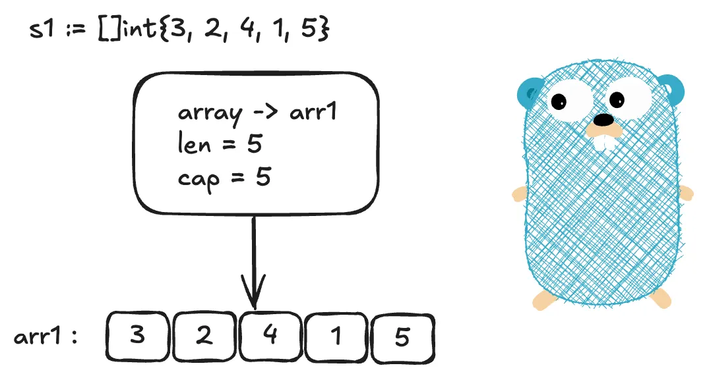

+++
date = '2026-09-30T15:55:22+08:00'
draft = false
title = 'Go 语言中的 Slice 类型'
categories = ['编程']
tags = ['Go', '基础知识', 'Slice', '类型']
+++

Slice（切片）是 Go 语言内置的**可变长度序列**，属于引用类型，基于底层数组封装实现，**解决数组长度固定、数组传参完整拷贝开销大的问题**，是 Go 开发最常用的数据结构之一。

# 1. Slice 的基础特性
- **可变长度**：长度不固定，可通过 `append` 动态追加元素。
- **底层数组共享**：切片本身不存储实际元素，元素存放在底层数组；多个切片可以指向同一个底层数组，修改会互相影响。
- **len 与 cap 分离**：`len`代表切片当前可用元素个数；`cap`代表底层数组允许的最大容量。
- **零值特性**：切片零值为 `nil`，`nil slice` len=0、cap=0；`nil slice` 和空切片 `[]int{}` 不相等。
- **引用语义**：切片变量存储的是结构体头信息，赋值、传参拷贝的是切片头，不是底层数组。
- **不可直接比较**：切片不能使用 `==` 判断两个切片内容是否相等，仅允许和 `nil` 做相等判断。

> [!Tip] 友情提示
> 上述特性与 Slice 的底层实现紧密关联，建议结合第 4 节"Slice 底层实现原理"章节阅读，以获得更深入的理解。

# 2. Slice 的四种初始化方式
切片必须初始化，`nil`切片可以读取、append，但不能直接对索引位置赋值。

## 2.1 声明未初始化（nil slice）
仅定义变量，底层数组指针为 nil，len=0、cap=0。
```go
// 声明nil切片，未分配底层数组
var a []string
fmt.Println(a == nil) // true
fmt.Println(len(a), cap(a)) // 0 0

// a[0] = "hello"
// 未初始化的切片直接赋值会引发 panic
// panic: index out of range
```

## 2.2 字面量初始化（空切片/带初始值）
直接初始化，分配底层数组，支持空切片和预设元素。
```go
// 1. 空切片，不为nil
s1 := []int{}

// 2. 带初始元素
s2 := []int{11,22,33}

fmt.Println(s1 == nil) // false
fmt.Println(s2) // [11 22 33]
```

## 2.3 make 函数初始化
使用内置函数`make([]T, len, cap)`进行初始化操作，cap 可省略，省略时 cap 等于 len。**适合预先知道数据量级的场景，可以减少扩容开销**。
```go
// len=3，cap=5
s := make([]int, 3, 5)
fmt.Println(len(s), cap(s)) //3 5

// 未赋值位置为元素零值
fmt.Println(s) // [0 0 0]
```

## 2.4 从数组/切片表达式生成切片
基于已有数组或者切片，通过切片表达式生成新切片，新切片和原数据共享底层数组。
```go
arr := [10]int{1,2,3,4,5,6,7,8,9,10}
// low:high，左闭右开
s1 := arr[1:6]
fmt.Println(s1) // [2 3 4 5 6]

// low:high:max，max 用来限制新切片的最大 cap
s2 := arr[1:6:8]
fmt.Println(len(s2), cap(s2)) // 5 7
```

# 3. Slice 常用操作
切片常用操作：索引读写、追加、切片表达式、拷贝、删除元素、获取长度容量。

## 3.1 索引读写
可以通过下标直接读写切片元素，下标越界会触发 panic。
```go
s := []int{10,20,30}

// 读
v := s[0]
fmt.Println(v) // 10


// 写
s[1] = 200
fmt.Println(s) // [10 200 30]
```
> [!CAUTION] 注意：
> 注意：索引只能访问`0 ~ len(s)-1`范围内下标，不能访问`len~cap`之间位置。

## 3.2 append 追加元素
Go 内置`append(slice, elem...)`函数，用来向切片尾部追加元素，**必须接收返回值**。
- 如果底层数组剩余容量足够，直接复用底层数组，修改会影响同源切片。
- 如果容量不足，触发自动扩容，分配全新底层数组，和旧底层数组解绑。
```go
numbers := []int{}
numbers = append(numbers, 1,2,3)
numbers = append(numbers, []int{4,5}...) //追加切片需要解包...
fmt.Println(numbers) // [1 2 3 4 5]
```
> [!CAUTION] 注意：
> 一旦追加元素触发扩容，运行时将分配一块全新的底层数组，并把旧数组的元素拷贝过去。自此以后，基于这两个底层数组的切片之间将彻底解耦，不再相互影响。


## 3.3 切片表达式
语法 `s[low:high:max]`
- **low**：起始下标，包含；省略默认为 0。
- **high**：结束下标，不包含；省略默认为 `len(s)`。
- **max**：可选，控制新切片的容量 cap；省略则 cap 继承原切片的 cap。
- 新切片：`len = high‑low`，`cap = max‑low`

```go
s1 := []int{1,2,3,4,5,6,7,8,9,10}
s2 := s1[1:6:8]
fmt.Println("len:",len(s2),"cap:",cap(s2)) // len=5 cap=7
```
这里有两个坑需要注意：
1. 由于切片表达式产生的切片和原切片共享底层数组，修改其中一个会影响另一个。
2. append 触发扩容后，新切片会生成一个新数组，此时新旧切片解绑，又互不影响。


## 3.4 copy 拷贝切片
直接赋值切片只是拷贝切片头，共享底层数组。想要创建一个完全独立的副本，需要使用内置函数`copy(dst, src []T)`。
- dst：目标 Slice
- src：数据来源 Slice

```go
a := []int{1,2,3,4,5}
b := make([]int, 5)
copy(b, a)

b[0] = 1000
fmt.Println(a) // [1 2 3 4 5]，a不受b修改影响
fmt.Println(b) // [1000 2 3 4 5]
```

另外，copy 函数会返回实际拷贝对象的元素个数，拷贝数量取`min(len(dst), len(src))`。除非你知道你在做什么，否则**最好预先给目标进行初始化且长度也保持一致**。
```go
a := []int{1, 2, 3, 4, 5}
b := make([]int, 7)
c := make([]int, 3)
var d []int
copy(b, a)
copy(c, a)
copy(c, d)

fmt.Println(b) // [1 2 3 4 5 0 0]
fmt.Println(c) // [1 2 3]
fmt.Println(d) // []
```

## 3.5 删除切片元素
Go 没有内置函数用于从 Slice 中删除元素，想要删除元素，可以使用 append 函数配合切片表达式来新建一个仅包含所需元素的 Slice 来实现。
```go
a := []int{1,2,3,4,5}

// 删除下标为2的元素
a = append(a[:2], a[3:]...)

fmt.Println(a) // [1 2 4 5]
```

## 3.6 获取长度与容量
- `len(slice)`：获取切片当前有效元素数量
- `cap(slice)`：获取切片底层数组容量
```go
s := make([]int,3,8)
fmt.Println(len(s), cap(s)) //3 8
```

# 4. Slice 底层实现原理
## 4.1 运行时切片结构体
切片在 runtime 中是结构体，源码位于`runtime/slice.go`
```go
type slice struct {
    array unsafe.Pointer // 指向底层数组的指针
    len  int             // 当前切片长度
    cap  int             // 底层数组容量
}
```
- `array`：指向底层数组第一个元素地址；nil slice 该指针为 nil。
- `len`：程序可以访问的元素个数，超过索引长度会触发 panic。
- `cap`：底层数组总空间，append 在不超过 cap 时复用数组。



上图为一个 Slice 的初始化过程，可以看到，Go 运行时为 Slice 创建了一个底层数组用来容纳 Slice 的值。Slice 可以理解成一个对底层数组的包装，操作 Slice，实际上就是对底层的数组进行操作。

> [!NOTE] 备注：
> 赋值`s2 = s1`：仅仅拷贝这三个字段，底层数组不复制，因此两个 slice 的数组还是指向同一块内存。

## 4.2 切片寻址与读写流程
1. 通过 slice 结构体拿到底层数组指针 array；
2. 访问`s[i]`等价于 `*(array + i *元素类型大小)`；
3. 索引 i 必须小于 len，否则张引发越界 panic。

## 4.3 append 底层流程
1. 判断`len(s) + 新增元素个数 <= cap(s)`
   - 条件成立：直接将新元素写到底层数组 len 位置后，修改 slice 的 len，返回新 slice 头；底层数组不变。
2. 条件不成立：触发扩容
   - 按扩容规则计算新 cap；
   - 在堆上分配全新底层数组；
   - 将旧数组全部元素拷贝到新数组；
   - 把待追加元素写入新数组；
   - 返回指向新数组的 slice 结构体，旧 slice 仍然指向旧数组。


**切片扩容规则**:
- 旧数组容量小于等于 256 时，每次扩容时容量**翻倍**。
- 旧数组容量大于 256 后，会通过一个公式进行计算，扩容倍数会慢慢由 1.63 降低到原容量的约 1.25 倍，减少内存浪费。

具体细节参见源码`src/runtime/slice.go`中的`nextslicecap`函数。

# 5. Slice 常见错误
## 5.1 错误1：nil 切片直接索引赋值
```go
var s []int
s[0] = 10 // panic: index out of range
```
**原因分析**：nil 切片没有底层数组，len=0，没有可访问下标。
**正确做法**：使用 make函数或字面量初始化切片。

## 5.2 错误2：切片共享底层数组，修改互相污染
```go
s1 := []int{1,2,3,4}
s2 := s1[:3]

s2[0] = 99
fmt.Println(s1) // s1也被修改 [99 2 3 4]
```
**原因分析**：切片表达式生成切片共享底层数组。
**正确做法**：需要独立数据，使用 copy 函数拷贝一份新切片。

## 5.3 错误3：append 不接收返回值
```go
var s []int
append(s,1,2,3) // 丢弃返回值，s没有变化

fmt.Println(s) // []
```
**原因分析**：append 返回新 slice 结构体；扩容时会产生全新切片头，原变量不会自动更新。
**正确做法**：`s = append(s,1,2,3)`。

## 5.4 错误4：在 for range 中修改切片元素
```go
s := []int{10,20,30}
for _,v := range s {
    v = v*2 //v是拷贝副本，不会修改原切片
}
fmt.Println(s) // [10 20 30]
```
**原因分析**：for range 遍历出来的元素值赋值给 v,这里的 v 是值副本，并不是指针。
**正确做法**：使用下标访问原切片
```go
for i := range s {
    s[i] = s[i]*2
}
```

## 5.5 错误5：用`==`直接比较两个切片
```go
a := []int{1,2}
b := []int{1,2}

fmt.Println(a == b) // 编译报错，invalid operation: a == b (slice can only be compared to nil)
```
**原因分析**：Go 语言中切片只能和 `nil` 进行比较，切片之间不支持使用`==`进行比较。
**正确做法**：Go 1.21 前需要自己循环逐个对比元素，1.21m之后可以使用 slices 标准库的 `slices.Equal` 函数。
```go
package main

import (
	"fmt"
	"slices"
)

func equalSlice[T comparable](a, b []T) bool {
	if len(a) != len(b) {
		return false
	}
	for i := range a {
		if a[i] != b[i] {
			return false
		}
	}
	return true
}

func main() {
	a := []int{1, 2, 3}
	b := []int{1, 2, 3}
	c := []int{1, 2}

	fmt.Println(slices.Equal(a, b)) // true
	fmt.Println(slices.Equal(a, c)) // false
	fmt.Println(equalSlice[int](a, b)) // true
}

```

## 5.6 错误6：切片删除元素产生内存泄漏
删除中间元素使用`append(a[:i],a[i+1:]...)`，被删掉的元素还存在底层数组，切片头只是缩短 len，如果底层数组持有大对象指针，对象不会被 GC。
```go
package main

import "fmt"

type BigData struct {
    Data []byte // 假设占用大量内存
}

func main() {
    // 创建一个指针切片
    items := make([]*BigData, 1000)
    for i := range items {
        items[i] = &BigData{Data: make([]byte, 1<<20)} // 每个 1MB
    }

    // 删除前 990 个元素，只保留最后 10 个
    items = items[990:]

    fmt.Println("len:", len(items), "cap:", cap(items))
    // 输出: len: 10, cap: 1000
}
```
**原因分析**:
1. `items[990:]` 只改变了切片的起始偏移和长度，底层数组仍完整保留，cap 仍为 1000。
2. 前 990 个 `*BigData` 指针看似被“删除”，实际仍存在于底层数组的前 990 个槽位，GC 仍能通过这些指针找到对应的 BigData 对象，因此不会回收它们。
3. 若该切片长期存活（如全局变量或长生命周期结构体字段），这 990 个大对象将一直占用内存。


**正确做法**：删除后手动置空被遗弃位置元素，帮助 GC 回收。
```go
// 方法1：手动置 nil 再截断（经典做法）
for i := 0; i < 990; i++ {
    items[i] = nil
}
items = items[990:]

// 方法2：复制到新切片，彻底切断引用
items = append([]*BigData{}, items[990:]...)

// 方法3：使用 Go 1.22+ 的 slices.Delete（内部已用 clear 处理尾部）
import "slices"
items = slices.Delete(items, 0, 990)
```

> [!CAUTION] 注意：
> 该问题仅对包含**指针/引用类型**的切片有意义。对于 `[]int`、`[]float64` 等值类型切片，删除后旧值虽仍在数组中，但只是普通数值，不构成 GC 意义上的泄漏。

