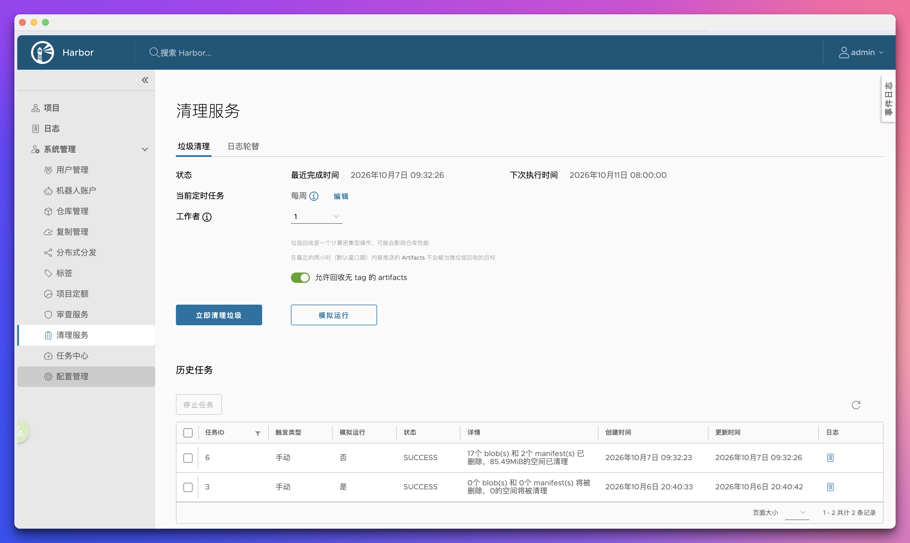

+++
date = '2026-10-03T11:32:44+08:00'
draft = false
title = 'Harbor私有镜像仓库安装部署和最佳实践'
categories = ['Infra']
tags = ['Harbor', '镜像仓库', '基础设施']
+++

# 1. 简介
Harbor 是 CNCF 托管、VMware 开源的企业级容器镜像仓库，基于 Docker Registry 二次开发。除基础镜像存储能力外，还提供 Web UI、细粒度RBAC权限、镜像漏洞扫描、垃圾回收、镜像复制同步、审计日志等企业级能力，是 Kubernetes 集群离线部署、容器镜像统一管理的核心组件。

**适用场景**：企业内网私有镜像托管、Kubespray 离线集群镜像分发、CI/CD流水线镜像仓库。

**官方参考文档**：
- Harbor 官方安装指南：[https://goharbor.io/docs/2.8.0/install-config/](https://goharbor.io/docs/2.8.0/install-config/)
- Harbor HTTPS 证书配置文档：[https://goharbor.io/docs/main/install-config/configure-https/](https://goharbor.io/docs/main/install-config/configure-https/)
- Harbor 版本生命周期与版本策略：[https://goharbor.io/docs/main/install-config/versioning/](https://goharbor.io/docs/main/install-config/versioning/)
- Harbor 备份恢复官方文档：[https://goharbor.io/docs/main/administration/backup-restore/](https://goharbor.io/docs/main/administration/backup-restore/)
- Harbor 生产环境最佳实践：[https://www.cncf.io/blog/2026/02/24/making-harbor-production-ready-essential-considerations-for-deployment/](https://www.cncf.io/blog/2026/02/24/making-harbor-production-ready-essential-considerations-for-deployment/)
- Harbor 官方 Trivy 文档：https://goharbor.io/docs/2.14.0/scan/
- Trivy 官方文档：[https://aquasecurity.github.io/trivy/](https://aquasecurity.github.io/trivy/)

# 2. 前置环境准备
## 2.1 Harbor版本选型指南
当前最新版已经到 v2.15.x，很多人会直接选用最新版，但**不建议生产直接上最新大版本**。

Harbor版本命名规则：`主版本.次版本.补丁号`，例如 `2.10.2`、`2.15.0`
- **奇数小版本（2.11、2.13、2.15）**：新特性版本，引入新功能、重构模块；bug相对多，适合测试体验，**不推荐生产直接使用**。
- **偶数小版本（2.10、2.12、2.14）**：长期维护稳定分支，重点修复漏洞，新增功能保守，**生产首选**。

举例：
- `v2.15.x`：新特性版，适合尝鲜、学习测试；
- `v2.14.x`：当前最新稳定偶数版；
- `v2.10.x`：久经大规模生产验证，bug少，社区问题资料极多，如果不需要新版本的一些新特性的话，推荐使用。

**企业生产环境**：优先选择**偶数LTS稳定分支**，发布至少3个月以上，积累足够补丁。不要选用刚发布的 `.0` 首版（例如 `2.15.0`），这类版本会存在较多未发现的bug。

## 2.2 基础依赖
Harbor 基于 Docker Compose V2 编排运行，提前准备依赖环境：
- Docker Engine：20.10+
- Docker Compose V2
- 系统架构：amd64 / arm64 均可支持（OrbStack、VMware虚拟机均可正常运行）
- 硬件资源：测试环境≥2核4G；生产环境≥4核8G，推荐SSD存储提升镜像读写性能


# 3. Harbor 离线安装流程
离线包稳定性高于在线安装，内网、离线集群优先选用。本文部署以`v2.14.4`版本为例。

## 3.1 下载官方离线安装包
```bash
# 创建安装目录
mkdir -p /opt/harbor && cd /opt/harbor

# 国内ghproxy加速下载Harbor离线包
wget "https://gh-proxy.org/https://github.com/goharbor/harbor/releases/download/v2.14.4/harbor-offline-installer-v2.14.4.tgz"

# 解压安装包
tar -zxvf harbor-offline-installer-v2.14.4.tgz
cd harbor
```

## 3.2 核心配置文件修改
下载好的安装包中提供了核心配置文件的模板，复制一份，修改核心参数：
```bash
# 生成配置文件
cp harbor.yml.tmpl harbor.yml
```

编辑 `harbor.yml`：
```yaml
# 1. 核心访问地址（务必修改为机器局域网IP/域名，禁止写127.0.0.1）
hostname: harbor.wuvikr.top

# 2. HTTP端口配置（生产环境建议HTTPS）
http:
  port: 80

# 3. HTTPS配置（生产环境开启，测试环境可注释）
# https:
#   port: 443
#   certificate: /opt/harbor/cert/harbor.crt
#   private_key: /opt/harbor/cert/harbor.key

# 4. 管理员密码（务必修改，禁止使用默认密码）
harbor_admin_password: Harbor@2026

# 5. 数据持久化目录（镜像、数据库、日志存储路径）
data_volume: /opt/harbor/data

# 6. 日志存储路径
log:
   location: /var/log/harbor

# 7. 关闭匿名访问（安全基础配置）
anonymous_access: false
```

> 关键说明：
> 1. `hostname`：集群节点访问仓库的核心地址，必须为局域网可通IP或域名；
> 2. `data_volume`：建议挂载独立磁盘/SSD，防止系统盘爆满；
> 3. HTTP 仅用于本地测试，**生产环境必须启用 HTTPS**。

## 3.3 HTTPS证书配置（生产环境必须）
Harbor 内置 Nginx 反向代理，HTTPS 流量由 Nginx 处理；证书存放在宿主机目录，挂载进容器即可。一般有两种方案：**自签名证书（内网/局域网）**、**CA正式证书（公网域名生产）**。

### 3.3.1 创建证书存放目录
```bash
# 在harbor宿主机创建证书目录
mkdir -p /opt/harbor/cert
cd /opt/harbor/cert
```

### 3.3.2 方案A：自签名证书
1. 生成CA根证书
```bash
# 生成CA私钥
openssl genrsa -out ca.key 4096

# 生成CA根证书，有效期10年
openssl req -x509 -new -nodes -key ca.key -sha256 -days 3650 -out ca.crt -subj "/CN=harbor-ca"

# 生成harbor服务器私钥
openssl genrsa -out harbor.key 4096

# 生成证书请求csr，CN填写你的harbor hostname（IP/域名）
openssl req -new -key harbor.key -out harbor.csr -subj "/CN=harbor.wuvikr.top"
```

2. 编写证书扩展文件（必须配置SAN，否则docker报证书名称不匹配）
```bash
vim extfile.cnf
```
extfile.cnf 内容：
```ini
# 同时写 IP + 域名
subjectAltName = IP:192.168.1.100,DNS:harbor.wuvikr.top
extendedKeyUsage = serverAuth

```

3. 签发harbor服务器证书
```bash
openssl x509 -req -in harbor.csr -CA ca.crt -CAkey ca.key \
-CAcreateserial -out harbor.crt -days 3650 -sha256 -extfile extfile.cnf
```
生成文件说明：
- `ca.crt`：根证书（**所有 K8s 节点、其他客户端都需要导入**）
- `harbor.crt`：Harbor 服务端证书
- `harbor.key`：Harbor 私钥，必须管理好

4. 修改harbor.yml启用HTTPS，注释HTTP区块
```yaml
hostname: 192.168.1.100

# 注释http区块
# http:
#   port: 80

# 开启https
https:
  port: 443
  certificate: /opt/harbor/cert/harbor.crt
  private_key: /opt/harbor/cert/harbor.key
```

### 3.3.3 方案B：正式CA证书
如果拥有域名，并从阿里云或者其他域名贩卖商处获取可信 CA 证书，直接替换证书路径：
```yaml
hostname: harbor.example.com
https:
  port: 443
  certificate: /opt/harbor/cert/fullchain.pem
  private_key: /opt/harbor/cert/privkey.pem
```
> 公网场景 hostname 必须填写域名，证书 SAN 必须匹配域名，不建议直接使用 IP 证书。

## 3.4 执行安装部署
```bash
./install.sh
```
安装成功标志：输出 `Harbor has been installed and started successfully.`
默认启动组件：UI、Registry、PostgreSQL、Redis、日志服务、Trivy漏洞扫描服务。

## 3.5 基础启停与运维命令
```bash
# 启动Harbor
docker compose up -d

# 停止Harbor
docker compose down

# 修改配置/证书后，重新加载配置
docker compose down && ./install.sh

# 查看所有容器运行状态
docker compose ps

# 实时查看日志
docker compose logs -f
```

# 4. 环境适配配置（客户端信任私有仓库）
分两种场景：**HTTP明文仓库（仅测试）** 和 **HTTPS证书仓库**

## 4.1 HTTP 明文仓库
1. **Docker**：需要在docker.json中配置`insecure-registries`参数，信任 http 仓库：
```json
{
  "insecure-registries": ["192.168.1.100:80"]
}
```
修改后重启 Docker 生效。

2. **Containerd**：假设 Harbor 地址是 http://192.168.1.100，端口默认 80。

```bash
mkdir -p /etc/containerd/certs.d/192.168.1.100

vim /etc/containerd/certs.d/192.168.1.100/hosts.toml
```
向 hosts.toml 写入：
```toml
server = "http://192.168.1.100"

[host."http://192.168.1.100"]
capabilities = ["pull", "resolve", "push"]
skip_verify = true
```
修改后重启 containerd 生效。

## 4.2 HTTPS证书仓库（生产推荐）
HTTPS合法证书场景**不需要配置insecure-registries**，只需要在所有客户端导入 CA 根证书即可。

#### Linux节点导入根证书
```bash
# Ubuntu/Debian
cp /opt/harbor/cert/ca.crt /usr/local/share/ca-certificates/harbor-ca.crt
update-ca-certificates

# Rocky/CentOS
cp /opt/harbor/cert/ca.crt /etc/pki/ca-trust/source/anchors/
update-ca-trust extract
```
导入完成**重启 containerd**。

#### Mac 导入根证书
```bash
# 将ca.crt添加到系统根证书信任
security add-trusted-cert -d -r trustRoot -k /Library/Keychains/System.keychain /opt/harbor/cert/ca.crt
```
导入完成**重启 Docker**。

# 5. 功能验证
## 5.1 网页访问验证
根据配置的`hostname`在浏览器打开网页地址，账号：`admin`，密码为`harbor.yml`中配置的`harbor_admin_password`。

可以尝试新建项目`test`，可设置为**公开项目**，在集群拉镜像无需登录。

## 5.2 证书校验
打开网页查看是否有不安全站点的提示，也可以用下面的命令进行检查：
```bash
# 验证HTTPS证书连通性
openssl s_client -connect 192.168.1.100:443
```

## 5.3 镜像推拉测试
```bash
# 拉取测试镜像
docker pull nginx:alpine

# 打私有仓库标签（格式：仓库IP/项目名/镜像名:版本）
docker tag nginx:alpine 192.168.1.100/k8s/nginx:alpine

# 登录Harbor
docker login 192.168.1.100 -u admin -p Harbor@2026

# 推送镜像
docker push 192.168.1.100/test/nginx:alpine

# 拉取私有镜像测试
docker pull 192.168.1.100/test/nginx:alpine
```
网页上能看到推送的镜像，代表仓库部署完全正常。

# 6. Harbor备份、恢复与定期清理
Harbor 不是单纯的文件仓库，它由 `镜像层数据 + PostgreSQL 元数据 + Redis 缓存 + 配置文件/密钥` 组成。

官方推荐的备份策略是：**数据库元数据备份 + 镜像存储卷备份**
- PostgreSQL：存储项目、用户、镜像元数据、扫描记录、RBAC权限，是核心元数据；
- data_volume：镜像blob层，体积巨大；

## 6.1 Harbor自动备份脚本
脚本功能：自动备份 PostgreSQL 数据库、镜像数据，自动清理N天前旧 sql 备份。
```bash
#!/bin/bash
set -e
# ========== 配置项，按需修改 ==========
BACKUP_HOST="备份机器IP"
REMOTE_DATA_PATH="/backup/harbor/harbor_full_data"
REMOTE_SQL_PATH="/backup/harbor/harbor_sql"
LOCAL_HARBOR_DIR="/opt/harbor/harbor"
DATE=$(date +%Y%m%d_%H%M%S)
# =====================================


# 1. 导出PostgreSQL数据库元数据，传输到远端
cd ${LOCAL_HARBOR_DIR}
docker compose exec -T postgresql pg_dump -U postgres registry > /tmp/harbor_db_${DATE}.sql
scp /tmp/harbor_db_${DATE}.sql root@${BACKUP_HOST}:${REMOTE_SQL_PATH}/
rm -f /tmp/harbor_db_${DATE}.sql

# 2. rsync全量同步/data目录到远端备份机
echo "===== Start rsync sync /data ====="
rsync -av --delete ../data/ root@${BACKUP_HOST}:${REMOTE_DATA_PATH}/

# 3. 远端自动清理7天前的sql备份
ssh root@${BACKUP_HOST} "find ${REMOTE_SQL_PATH} -name 'harbor_db_*.sql' -mtime +7 -delete"

echo "✅ Harbor全量备份完成！"
echo "远端SQL文件：${REMOTE_SQL_PATH}/harbor_db_${DATE}.sql"
echo "远端data目录：${REMOTE_DATA_PATH}"
```

#### 使用方法
1. 保存脚本，赋予执行权限
```bash
vim /opt/harbor/harbor_backup.sh
chmod +x /opt/harbor/harbor_backup.sh
```
2. 手动测试执行
```bash
/opt/harbor/harbor_backup.sh
```
3. Crontab定时任务（每日凌晨2点自动备份）
```bash
crontab -e
# 添加一行
0 2 * * * /opt/harbor/harbor_backup.sh >> /var/log/harbor_backup.log 2>&1
```

> [!CAUTION] 注意：
> 1. 上面脚本仅备份**元数据（数据库+配置）和镜像数据**，harbor.yaml 配置文件和证书也是需要备份的，这两个不会经常变动，平时按需手动备份即可。
> 2. harbor 机器需要免密登录远端备份机器，另外还需要提前创建好对应备份目录。

## 6.2 数据库灾难恢复
恢复前：停止 Harbor，使用同版本 Harbor 环境。
```bash
# 1. 停止harbor
cd /opt/harbor/harbor
docker compose down

# 2. 备份旧 data 目录
mv data data_old_bak

# 3. 创建新的data空目录，将备份的镜像数据目录拷贝回来
mkdir data
tar -zxvf harbor_data_xxx.tar.gz -C ./data/

# 4. 仅启动数据库，导入元数据
docker compose up -d postgresql
docker compose exec -T postgresql psql -U postgres registry < harbor_db_xxx.sql

# 5. 启动 harbor
docker compose up -d
```
> [!CAUTION] 重要注意事项：
> - 恢复时，必须保证**Harbor 版本和备份时版本一致**
> - 恢复顺序：**先恢复 data 目录，再导入数据库元数据**，顺序颠倒会造成元数据与镜像 blob 不一致。
> - 完整备份 4 件套：`data目录包 + postgres数据库sql + harbor.yml + HTTPS证书`。
> - 备份后定期做恢复演练，验证备份可用性。

## 6.3 垃圾镜像清理
可以在 WebUI 配置清理未被引用的 blob 镜像层，释放磁盘空间。执行期间尽量选择低峰时段，仓库建议设置为只读，避免镜像推送导致数据不一致。

垃圾镜像清理最好在**执行完整备份**后进行，防止误删除；另外生产不要频繁清理，每周一次足够。

## 6.4 备份与GC最佳实践
1. **备份分层策略**
   - 每日：PostgreSQL元数据自动备份（脚本）
   - 每周：底层存储快照（LVM/云硬盘快照，备份整个`data_volume`镜像blob）
2. 备份文件异地存储，不要和 Harbor 宿主机放在同一磁盘。
3. 定期做**恢复演练**，每季度测试一次备份包是否可以正常恢复。
4. GC 操作前必须备份，优先 dry-run 预览，避免误删正在使用的镜像层。

# 7. 启用 Trivy 自动镜像漏洞扫描
使用 `install.sh` 脚本安装 Harbor 时添加 `--with-trivy` 参数就可以额外部署 Trivy 组件。如果安装时没有添加该参数，WebUI 上看不到扫描器也不要紧，**不需要重装Harbor，可在线追加部署Trivy，原有镜像、项目、账号全部保留**。

## 7.1 追加部署 Trivy-adapter
操作前最好备份配置，禁止使用 `docker compose down -v`（`-v` 会删除数据卷，镜像全部丢失）。
```bash
# 进入harbor解压目录
cd /opt/harbor/harbor

# 备份harbor.yml
cp harbor.yml harbor.yml.bak.$(date +%Y%m%d)

# 停止harbor服务
docker compose down

# 核心：重新生成docker-compose配置，追加Trivy组件
./prepare --with-trivy

# 重新拉起所有服务（包含新增的harbor-trivy-adapter）
docker compose up -d
```

**验证 Trivy 组件是否正常启动**：
```bash
# 查看trivy容器
docker compose ps | grep trivy
```
正常状态：`harbor-trivy-adapter` 状态为 `Up`

查看 Trivy 日志，排查启动/漏洞库下载问题：
```bash
docker compose logs -f trivy-adapter
```
> [!TIP] 提示：
> 首次启动会自动下载 Trivy 漏洞库，国内网络容易超时；可在 WebUI 扫描器配置中填入 GitHub Token 缓解限流，离线内网可勾选跳过漏洞库自动更新，手动导入`trivy.db`。

## 7.2 将 Trivy 设置为默认扫描器
1. 登录 Harbor WebUI 后台
2. 左侧菜单：**系统管理 → 审查服务 → 扫描器(Scanners)**
3. 在扫描器列表选中 `Trivy`，点击 **设为默认(Set as default)**
> Harbor 全局只能有一个默认扫描器，2.14 版本已移除 Clair，直接默认就是 Trivy。

## 7.3 推送镜像自动扫描
自动扫描是**项目级别开关**，不会全局生效，需要逐个项目开启。
1. 进入【项目(Projects)】→ 打开项目 `k8s`
2. 切换到 **配置管理(Configuration)**
3. 在`漏洞扫描（Vulnerability Scanning）`区域：
    - 勾选 **Automatically scan images on push（推送镜像时自动扫描）**
    - 可选：`Automatically scan SBOM on push` 自动生成SBOM物料清单
4. 【生产推荐】漏洞拉取阻断策略
    `Prevent vulnerable images from being pulled`：配置阈值，例如**存在Critical严重漏洞禁止拉取镜像**，作为上线兜底防护。
5. 点击保存。

设置后，**新推送的镜像会自动触发Trivy扫描；存量历史镜像不会自动扫描，需要手动批量扫描**。

## 7.4 历史镜像定期扫描
建议定期执行漏洞扫描，Trivy 漏洞库每日都会进行更新，旧镜像会爆出新增 CVE 漏洞。

在 WebUI 页面左侧，依次点击**系统管理 → 审查服务 → 漏洞**，这里可以设置定期扫描所有，一次性扫描项目内所有存量镜像。

**API方式开启项目全量扫描（适合自动化脚本）**：
```bash
#!/bin/bash

HARBOR_URL="https://harbor.wuvikr.top"
HARBOR_USER="admin"
HARBOR_PASS="你的密码"

# 获取所有项目
projects=$(curl -k -s -u "$HARBOR_USER:$HARBOR_PASS" \
  "$HARBOR_URL/api/v2.0/projects" | \
  jq -r '.[].project_id')

for proj_id in $projects; do
  echo "=== 扫描项目 ID: $proj_id ==="

  # 立即触发该项目所有镜像的扫描
  curl -k -s -u "$HARBOR_USER:$HARBOR_PASS" -X POST \
    "$HARBOR_URL/api/v2.0/projects/$proj_id/scan" \
    -H "Content-Type: application/json" \
    -d '{}'

  echo ""
done

echo "全部项目扫描任务已提交"
```

## 7.5 CICD 流水线扫描 vs Harbor内置 Trivy
推荐生产采用 **CI 前置 Trivy 扫描 + Harbor 内置 Trivy 二次扫描**双层防护，二者不是二选一。

|维度|CI流水线Trivy（入库前扫描）|Harbor内置Trivy（入库后扫描）|
|---|---|---|
|扫描时机|镜像构建完成，**推送到Harbor之前**|镜像推送到Harbor仓库**之后**|
|存量镜像重扫|❌ 不会自动重扫历史镜像|✅ 支持定期批量重扫，捕获后续新爆出CVE|
|拦截作用|高危漏洞直接中断流水线，坏镜像**不进仓库**|镜像入库后检测，可禁止高危镜像**被K8s拉取部署**|
|漏洞库时效|仅本次构建瞬间的漏洞快照，不会自动更新重扫|自动每日更新漏洞库，持续监控存量镜像风险|
|适用场景|安全左移，开发阶段第一道门禁|仓库统一漏洞审计、兜底防护，防止手动绕过CI上传镜像|

**CI 流水线 Trivy 极简示例**：
```bash
# 构建镜像
docker build -t harbor.wuvikr.top/k8s/nginx:${CI_COMMIT_SHA} .

# Trivy扫描，存在严重/高危漏洞则退出码1，流水线失败
trivy image --severity CRITICAL,HIGH --exit-code 1 --no-progress harbor.wuvikr.top/k8s/nginx:${CI_COMMIT_SHA}

# 扫描通过，才执行推送
docker push harbor.wuvikr.top/k8s/nginx:${CI_COMMIT_SHA}
```

# 8. 生产环境最佳实践
## 8.1 安全规范
1. **密码强制修改**：部署完成后立即修改admin管理员密码，定期轮换，禁止弱密码。
2. **优先HTTPS通信**：生产环境必须启用 HTTPS。内网环境优先使用自签名证书，公网环境使用可信 CA 证书；禁止生产使用 HTTP 明文仓库。证书有效期提前 30 天轮换，私钥文件权限设置`chmod 600 harbor.key`，仅 root 可读。
3. **关闭匿名访问**：生产环境严格开启权限管控，仅授权账号可推拉镜像。
4. **开启镜像漏洞扫描**：启用 Trivy 漏洞扫描，自动检测镜像漏洞，禁止高危漏洞镜像入库。
5. **权限分级管理**：按团队创建独立项目，配置项目级读写权限，减少超级账号 admin 的使用。
6. **版本选型策略**：生产环境优先选择偶数稳定分支，不使用刚发布的`.0`版本；大版本升级前完整备份数据，先在测试环境验证。定期查看官方安全公告，及时打补丁版本，而不是盲目升级到大版本。

## 8.2 性能与存储优化
1. **存储硬件选型**：`data_volume`挂载 SSD 高速存储，禁止机械硬盘，提升镜像推拉速度。
2. **独立磁盘挂载**：镜像数据目录单独挂载独立磁盘，避免系统盘爆满导致服务宕机。
3. **资源配额限制**：通过 Docker 限制 Harbor 容器 CPU、内存资源，防止资源抢占。
4. **架构适配**：arm64 集群统一拉取 arm64 镜像，amd64 集群使用 amd64 镜像，避免`exec format error`架构不匹配报错。

## 8.3 镜像安全扫描最佳实践
1. **双防线策略（推荐）**：
    - CI流水线前置扫描：构建镜像后，使用Trivy在CI环节扫描，**高危漏洞直接阻断构建，禁止推送到Harbor**，从源头拦截坏镜像。
    - Harbor自动扫描兜底：所有推送到仓库的镜像，开启推送自动扫描；用于存量镜像、外部导入镜像的安全巡检。
2. **漏洞分级阻断**：
    项目内配置安全策略：高危(Critical)漏洞：禁止拉取；高危+高(High)漏洞：不允许部署到生产集群；低危漏洞：可做记录跟踪，定期修复。
3. **漏洞库更新策略**：在线环境：Trivy 自动每日更新漏洞库；离线隔离环境：定期手动下载离线漏洞库，导入Harbor Trivy，**固定更新周期（每周）**。
4. **存量镜像巡检**：定期批量扫描仓库内存量镜像，不要只扫描新推送镜像；可以在控制台设置或者调用 Harbor API 编写定时批量扫描脚本，生成漏洞报表。
5. **权限最小化**：扫描使用机器人账号，仅赋予项目只读权限，不使用 admin 账号做 CI 扫描；普通项目用户不允许修改安全阻断策略，仅管理员可修改。
6. **扫描性能优化**：对大镜像、基础镜像（如centos/ubuntu）扫描耗时久，可合理设置扫描并发数，避免 Trivy 服务CPU/内存打满；对可信基础镜像（内部维护的基础镜像），可按需豁免扫描，减少资源消耗。
7. **审计留存**：开启Harbor审计日志，记录：镜像扫描记录、漏洞策略修改记录、镜像拉取阻断记录，满足等保/安全审计要求。

## 8.4 运维与高可用规范
1. **定时垃圾回收GC**：后台配置定时垃圾回收，每周清理废弃镜像、未引用镜像层，释放磁盘空间；GC 操作建议业务低峰执行。
2. **数据定时备份**：分层备份 PostgreSQL 数据库和`data_volume`镜像数据目录，异地保存备份文件，定期演练恢复。
3. **日志持久化**：开启日志轮转，防止日志无限膨胀；审计日志留存`≥90`天。
4. **高可用部署**：大规模集群使用 Helm 部署 Harbor高可用版本，外接独立 Redis、数据库、对象存储，消除单点故障。
5. **版本锁定**：生产环境锁定稳定版本，禁止随意升级；升级前完整备份数据，先在测试环境验证。

