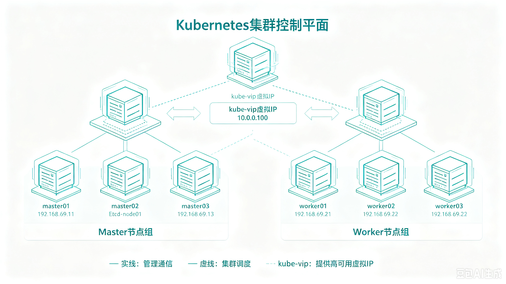

+++
date = '2026-09-09T10:54:51+08:00'
draft = true
title = '使用kubeadm 部署高可用集群'
categories = ['Kubernetes']
tags = ['K8S', '集群部署','Kube-vip','Kubeadm']
+++

[kubeadm 安装官方文档](https://kubernetes.io/zh/docs/setup/production-environment/tools/kubeadm/)

# 0. 引言

Kubernetes 高可用架构的核心在于保障 API Server 的访问连续性与 etcd 的数据可靠性。通常通过部署多 Master 节点并前置负载均衡来实现，本方案采用 `kube-vip` 承担此角色。为节省资源，本文将负载均衡与 etcd 集群复用部署于 Master 节点；**生产环境请务必将其独立部署，以确保集群稳定性。**

本文基于 Ubuntu 24.04 环境编写。若使用其他 Linux 发行版，请根据实际情况自行调整相关命令。

---

# 1. 环境架构

## 1.1. 角色划分

| 主机名      | IP            | 角色                               |
| -------- |:-------------:|:--------------------------------:|
| master01 | 192.168.69.11 | master01、Etcd-node01、kube-vip 节点 |
| master02 | 192.168.69.12 | master02、Etcd-node02、kube-vip 节点 |
| master03 | 192.168.69.13 | master03、Etcd-node03、kube-vip 节点 |
| worker01 | 192.168.69.21 | worker01                         |
| worker02 | 192.168.69.22 | worker02                         |
| worker03 | 192.168.69.23 | worker03                         |
| 虚拟IP     | 10.0.0.100    | kube-vip 提供                      |

## 1.2. 拓扑图



---

# 2. 操作系统初始化

## 2.1. Linux 基础配置

```bash
# 关闭防火墙
ufw disable

# 关闭 swap
swapoff -a && sysctl -w vm.swappiness=0
sed -ri 's/.*swap.*/#&/' /etc/fstab

# 配置主机名和 hosts
hostnamectl set-hostname <hostname>
cat >> /etc/hosts << EOF
192.168.69.11 master01.wuvikr.top master01
192.168.69.12 master02.wuvikr.top master02
192.168.69.13 master03.wuvikr.top master03
192.168.69.21 worker01.wuvikr.top worker01
192.168.69.22 worker02.wuvikr.top worker02
192.168.69.23 worker03.wuvikr.top worker03
192.168.69.100 kubeapi.wuvikr.top kubeapi
EOF


# 配置 limit
ulimit -SHn 65535

# 持久化 limit 配置（重新登录后生效）
cat >> /etc/security/limits.conf << EOF
* soft nofile 65536
* hard nofile 131072
* soft nproc 65535
* hard nproc 655350
* soft memlock unlimited
* hard memlock unlimited
* soft core unlimited
* hard core unlimited
EOF
```

## 2.2. 时间同步

```bash
# 同步硬件时钟到系统时间（虚拟机环境中可选）
hwclock -s

# 设置时区（推荐方式，一步完成）
timedatectl set-timezone Asia/Shanghai

# 确保时间同步服务已启用（Ubuntu 24.04 默认已启用）
systemctl enable --now systemd-timesyncd

# 查看时间同步状态
timedatectl status


```

> Ubuntu 24.04 内置的 `systemd-timesyncd` 提供轻量级 NTP 客户端功能，支持自动同步、漂移补偿和状态查询。如需更高精度的时间同步（如金融、日志审计场景），建议改用 `chrony` 替代 `systemd-timesyncd`。

## 2.3. ssh 免密登录（可选）

```bash
# 在 master01 上执行以下操作
ssh-keygen
ssh-copy-id 127.0.0.1

scp -r .ssh master02:/root/
scp -r .ssh master03:/root/
scp -r .ssh worker01:/root/
scp -r .ssh worker02:/root/
scp -r .ssh worker03:/root/
```

## 2.4. 安装 ipvs 并加载到内核模块

```bash
# 安装必要工具包
apt update
apt install -y ipvsadm ipset sysstat conntrack-tools libseccomp2

# 开机加载模块
tee /etc/modules-load.d/ipvs.conf << EOF
ip_vs
ip_vs_lc
ip_vs_wlc
ip_vs_rr
ip_vs_wrr
ip_vs_lblc
ip_vs_lblcr
ip_vs_dh
ip_vs_sh
ip_vs_fo
ip_vs_nq
ip_vs_sed
ip_vs_ftp
nf_conntrack
ip_tables
ip_set
xt_set
ipt_rpfilter
ipt_REJECT
ipip
EOF

# 开机启动模块自动加载服务
systemctl enable --now systemd-modules-load.service
```

## 2.5. 修改内核参数

```bash
# 1. 确保 br_netfilter 模块已加载（bridge-nf-call 参数生效的前提）
sudo modprobe br_netfilter
echo 'br_netfilter' | sudo tee -a /etc/modules-load.d/k8s.conf

# 2. 写入适配后的 sysctl 配置
sudo tee /etc/sysctl.d/99-k8s-tuning.conf << 'EOF'
# === 网络基础 ===
net.ipv4.ip_forward = 1
net.bridge.bridge-nf-call-iptables = 1
net.bridge.bridge-nf-call-ip6tables = 1

# === 容器运行时支持 ===
vm.overcommit_memory = 1
vm.panic_on_oom = 0
fs.inotify.max_user_instances = 256
fs.inotify.max_user_watches = 262144
fs.file-max = 52706963
fs.nr_open = 52706963

# === conntrack 优化 ===
net.netfilter.nf_conntrack_max = 2310720

# === TCP 调优 ===
net.ipv4.tcp_keepalive_time = 600
net.ipv4.tcp_keepalive_probes = 3
net.ipv4.tcp_keepalive_intvl = 15
net.ipv4.tcp_max_tw_buckets = 36000
net.ipv4.tcp_tw_reuse = 1
net.ipv4.tcp_max_orphans = 327680
net.ipv4.tcp_orphan_retries = 3
net.ipv4.tcp_syncookies = 1
net.ipv4.tcp_max_syn_backlog = 16384
net.ipv4.tcp_timestamps = 1
net.core.somaxconn = 16384
EOF

# 3. 应用所有 sysctl 配置
sudo sysctl --system

# 4. 验证关键参数是否生效
sysctl net.ipv4.ip_forward \
       net.bridge.bridge-nf-call-iptables \
       net.netfilter.nf_conntrack_max \
       vm.overcommit_memory
```

---

# 3. 安装 Containerd

[kubeadm 运行时配置](https://kubernetes.io/docs/setup/production-environment/container-runtimes/)

[containerd 官方仓库](https://github.com/containerd/containerd)

为了提升安装速度，这里使用阿里云镜像地址。

| 用途            | 地址                                                      |
| ------------- | ------------------------------------------------------- |
| Docker CE 软件源 | `https://mirrors.aliyun.com/docker-ce/linux/ubuntu`     |
| GPG 公钥        | `https://mirrors.aliyun.com/docker-ce/linux/ubuntu/gpg` |

如果镜像源不可用，可换成以下备用镜像源：

| 提供方 | 地址                                                         |
| --- | ---------------------------------------------------------- |
| 华为云 | `https://mirrors.huaweicloud.com/docker-ce/linux/ubuntu`   |
| 腾讯云 | `https://mirrors.cloud.tencent.com/docker-ce/linux/ubuntu` |
| 中科大 | `https://mirrors.ustc.edu.cn/docker-ce/linux/ubuntu`       |

> 切换备用镜像时，只需把下面命令中的 `mirrors.aliyun.com` 换成对应域名，`gpg` 文件通常也有相同的相对路径。

## 3.1. 添加 docker 官方 apt 源

```bash
# 安装基础依赖
apt update
apt install -y ca-certificates curl

# 下载 GPG 公钥（走阿里云镜像）
install -m 0755 -d /etc/apt/keyrings
curl -fsSL https://mirrors.aliyun.com/docker-ce/linux/ubuntu/gpg \
  -o /etc/apt/keyrings/docker.asc
chmod a+r /etc/apt/keyrings/docker.asc

# 写入 apt 源
echo \
  "deb [arch=$(dpkg --print-architecture) signed-by=/etc/apt/keyrings/docker.asc] \
  https://mirrors.aliyun.com/docker-ce/linux/ubuntu \
  $(. /etc/os-release && echo "$VERSION_CODENAME") stable" | \
  tee /etc/apt/sources.list.d/docker.list > /dev/null
```

## 3.2. 更新源并安装 containerd.io

```bash
# 先清理系统自带的
apt update
apt install -y containerd.io
```

## 3.3. 安装后配置

```bash
# 生成默认配置文件
c
# 启用 systemd cgroup 驱动
sed -i 's/SystemdCgroup = false/SystemdCgroup = true/' /etc/containerd/config.toml

# 修改 pause 镜像地址
sed -i "s#registry.k8s.io#registry.cn-hangzhou.aliyuncs.com/google_containers#g"  /etc/containerd/config.toml

# 重启服务并设置开机自启动
sudo systemctl restart containerd
sudo systemctl enable containerd
```

---

# 4. 安装 kubeadm、kubelet 和 kubectl

在所有节点上安装 kubeadm、kubelet 和 kubectl，安装方式参考[官方文档](https://kubernetes.io/zh-cn/docs/setup/production-environment/tools/kubeadm/install-kubeadm/)和[阿里云镜像源](https://developer.aliyun.com/mirror/kubernetes?spm=a2c6h.13651102.0.0.3e221b11cRv43u)。

## 4.1. 添加阿里镜像源仓库

```
# 要安装的版本号
$ K8S_VERSION="v1.32"

# 安装前置依赖
sudo apt-get update && sudo apt-get install -y apt-transport-https ca-certificates curl

# 创建 GPG 密钥目录并导入签名密钥
sudo mkdir -p /etc/apt/keyrings
curl -fsSL https://mirrors.aliyun.com/kubernetes-new/core/stable/v1.32/deb/Release.key \
    | sudo gpg --dearmor -o /etc/apt/keyrings/kubernetes-apt-keyring.gpg

# 添加 apt 源
echo "deb [signed-by=/etc/apt/keyrings/kubernetes-apt-keyring.gpg] https://mirrors.aliyun.com/kubernetes-new/core/stable/v1.32/deb/ /" \
    | sudo tee /etc/apt/sources.list.d/kubernetes.list

# 更新索引
sudo apt update
```

## 4.2. 查看版本并安装

```bash
# 查看版本
apt-cache madison kubeadm
# 安装指定版本
apt -y install kubeadm=1.32.13-1.1 kubectl=1.32.13-1.1 kubelet=1.32.13-1.1

# 锁定版本（可选但推荐）
sudo apt-mark hold kubelet kubeadm kubectl

# 启动kubelet
systemctl daemon-reload
systemctl enable --now kubelet
```

---

# 5. 部署 ETCD

## 5.1 创建目录和用户

在所有运行 etcd 服务的机器上执行：

```bash
# 创建数据目录（建议挂载独立 SSD）
mkdir -p /var/lib/etcd

# 创建配置目录
mkdir -p /etc/etcd

# 创建 etcd 系统用户
groupadd --system etcd
useradd -s /sbin/nologin --system -g etcd etcd

# 调整目录权限
chown -R etcd:etcd /var/lib/etcd
chmod 700 /var/lib/etcd
```

## 5.2. 安装 cfssl 证书工具

[Gitlab 项目地址](https://github.com/cloudflare/cfssl)

```bash
# 下载工具包
wget https://gh-proxy.org/https://github.com/cloudflare/cfssl/releases/download/v1.6.5/cfssl_1.6.5_linux_amd64
wget https://gh-proxy.org/https://github.com/cloudflare/cfssl/releases/download/v1.6.5/cfssljson_1.6.5_linux_amd64

# 添加执行权限
chmod +x cfssl*

# 移动并重命名
mv cfssl_1.6.5_linux_amd64 /usr/local/bin/cfssl
mv cfssljson_1.6.5_linux_amd64 /usr/local/bin/cfssljson
```

## 5.3 生成 Etcd 证书

创建证书目录：

```bash
mkdir -p ~/etcd-certs

cd ~/etcd-certs
```

### 5.3.1 生成 CA 配置文件

- 根证书配置文件，etcd-ca-config.json：
  
  ```bash
  {
      "signing": {
          "default": {
              "expiry": "87600h"
          },
          "profiles": {
              "etcd": {
                  "expiry": "87600h",
                  "usages": [
                      "signing",    
                      "key encipherment",
                      "server auth",
                      "client auth"
                  ]
              }
          }
      }
  }
  ```

- 证书申请文件，etcd-ca-csr.json：
  
  ```bash
  {
      "CN": "etcd-ca",
      "key": {
          "algo": "rsa",
          "size": 2048
      },
      "names": [
          {
              "C": "CN",
              "L": "Shanghai",
              "ST": "Shanghai",
              "O": "etcd",
              "OU": "Etcd Security"
          }
      ]
  }
  ```

### 5.3.2. 生成 CA 根证书：

```bash
cfssl gencert -initca etcd-ca-csr.json | cfssljson -bare etcd-ca -
```

执行后会得到 etcd-ca.pem（根证书）、etcd-ca-key.pem（根私钥）、etcd-ca.csr。

### 5.3.3. 生成 Etcd Server 证书

- 证书申请文件，etcd-server-csr.json：

```bash
{
    "CN": "etcd",
    "hosts": [
        "127.0.0.1",
        "master01",
        "master02",
        "master03",
        "192.168.69.11",
        "192.168.69.12",
        "192.168.69.13"
    ],
    "key": {
        "algo": "rsa",
        "size": 2048 
    },
    "names": [
        {
            "C": "CN",
            "L": "Shanghai",
            "ST": "Shanghai"
        }
    ]
}
```

hosts 字段中的 IP 为所有 etcd 节点的集群内部通信 IP，为了方便后期扩容可以多写几个预留IP。

- 生成 etcd server 证书：

```bash
cfssl gencert -ca=etcd-ca.pem \
              -ca-key=etcd-ca-key.pem \
              -config=etcd-ca-config.json \
              -profile=etcd \
              etcd-server-csr.json | cfssljson -bare etcd-server
```

执行后会得到 etcd-server.pem（etcd 服务的证书）、etcd-server-key.pem（etcd 服务的私钥）、etcd-server.csr。

### 5.3.4. 分发证书到其他节点

```bash
# 在每台 etcd 节点上创建证书目录
mkdir -p /etc/etcd/pki
chown -R etcd:etcd /etc/etcd/pki
chmod 755 /etc/etcd/pki

# 从管理节点分发（在管理节点执行）
for node in 192.168.69.11 192.168.69.12 192.168.69.13; do
    scp etcd-ca.pem etcd-server.pem etcd-server-key.pem ${node}:/tmp/
    ssh ${node} "mv /tmp/etcd* /etc/etcd/pki/ && chown etcd:etcd /etc/etcd/pki/* && chmod 600 /etc/etcd/pki/*-key.pem"
done
```

## 5.4 部署 Etcd 集群

[Gitlab 项目地址](https://github.com/etcd-io/etcd)

### 5.4.1. 下载&配置

```bash
# 替换为实际版本号
ETCD_VERSION="v3.6.10"

# 切换目录
cd /tmp

# 使用 gh-proxy.org 加速下载
wget https://gh-proxy.org/https://github.com/etcd-io/etcd/releases/download/${ETCD_VERSION}/etcd-${ETCD_VERSION}-linux-amd64.tar.gz
tar -zxvf etcd-${ETCD_VERSION}-linux-amd64.tar.gz
cp etcd-${ETCD_VERSION}-linux-amd64/etcd* /usr/local/bin/

# 验证
etcd --version
etcdctl version


# 节点下载好的可执行文件到其他节点
for node in 192.168.69.12 192.168.69.13; do
    scp /usr/local/bin/etcd* ${node}:/usr/local/bin/
done
```

### 5.4.2. 编写 etcd 配置文件

在**每台节点**上创建 `/etc/etcd/etcd.conf`，注意修改 `ETCD_NAME` 和 `ETCD_INITIAL_ADVERTISE_PEER_URLS` 中的 IP 为本机 IP。

**节点 etcd-01（192.168.69.11）​：**

```bash
# # 节点名称（每台不同）
ETCD_NAME="etcd-1"

# etcd 数据存储目录
ETCD_DATA_DIR="/var/lib/etcd"

# 本节点对外通信的 peer URL（集群内部 raft 通信）
ETCD_INITIAL_ADVERTISE_PEER_URLS="https://192.168.69.11:2380"
# 本节点对外暴露的 client URL（客户端连接）
ETCD_ADVERTISE_CLIENT_URLS="https://192.168.69.11:2379"

# 本节点监听的 peer URL
ETCD_LISTEN_PEER_URLS="https://192.168.69.11:2380"
# 本节点监听的 client URL
ETCD_LISTEN_CLIENT_URLS="https://192.168.69.11:2379"


# 初始集群所有成员（三节点统一）
ETCD_INITIAL_CLUSTER="etcd-1=https://192.168.69.11:2380,etcd-2=https://192.168.69.12:2380,etcd-3=https://192.168.69.13:2380"

# 集群 token（同一集群保持一致即可）
ETCD_INITIAL_CLUSTER_TOKEN=etcd-cluster-token

# 集群状态（新建集群用 new，已有集群新增节点用 existing）
ETCD_INITIAL_CLUSTER_STATE="new"

# TLS 证书路径
ETCD_CERT_FILE=/etc/etcd/pki/etcd-server.pem
ETCD_KEY_FILE=/etc/etcd/pki/etcd-server-key.pem
ETCD_TRUSTED_CA_FILE=/etc/etcd/pki/etcd-ca.pem

# 开启 peer 之间的 TLS
ETCD_PEER_CERT_FILE=/etc/etcd/pki/etcd-server.pem
ETCD_PEER_KEY_FILE=/etc/etcd/pki/etcd-server-key.pem
ETCD_PEER_TRUSTED_CA_FILE=/etc/etcd/pki/etcd-ca.pem

# 自动压缩历史数据（保留 1 小时）
ETCD_AUTO_COMPACTION_RETENTION=1

# 快照计数（每 10000 次写入触发一次快照）
ETCD_SNAPSHOT_COUNT=10000

# 心跳间隔（毫秒）
ETCD_HEARTBEAT_INTERVAL=250

# 选举超时（毫秒）
ETCD_ELECTION_TIMEOUT=5000
```

### 5.4.3. 创建 service 文件

在**每台节点**上创建 `/etc/systemd/system/etcd.service`：

```
[Unit]
Description=etcd - A distributed, reliable key-value store
Documentation=https://etcd.io/docs
After=network-online.target
Wants=network-online.target

[Service]
Type=notify
User=etcd
Group=etcd
EnvironmentFile=/etc/etcd/etcd.conf
ExecStart=/usr/local/bin/etcd
Restart=always
RestartSec=10s
LimitNOFILE=65536

# 安全加固
NoNewPrivileges=true
ProtectSystem=strict
ProtectHome=true
ReadWritePaths=/var/lib/etcd

[Install]
WantedBy=multi-user.target
```

### 5.4.4. 加载配置并启动服务

依次在**每台节点**上执行：

```
systemctl daemon-reload
systemctl enable --now etcd
```

**注意**：第一台启动后会等待其他节点加入，属于正常现象

### 5.4.5. 查看集群状态

使用 etcdctl 命令查看整个集群的状态：

```bash
ETCDCTL_API=3 /usr/local/bin/etcdctl --write-out=table \
  --cacert=/etc/etcd/pki/etcd-ca.pem \
  --cert=/etc/etcd/pki/etcd-server.pem \
  --key=/etc/etcd/pki/etcd-server-key.pem \
  --endpoints="https://192.168.69.11:2379,https://192.168.69.12:2379,https://192.168.69.13:2379" \
  endpoint health
```

出现下面的表格即说明集群部署成功：

```bash
+----------------------------+--------+-------------+-------+
|          ENDPOINT          | HEALTH |    TOOK     | ERROR |
+----------------------------+--------+-------------+-------+
| https://192.168.69.11:2379 |   true | 13.689167ms |       |
| https://192.168.69.12:2379 |   true | 16.782417ms |       |
| https://192.168.69.13:2379 |   true |  20.50225ms |       |
+----------------------------+--------+-------------+-------+
```

如果有问题请查看日志进行排查：`/var/log/message` 或 `journalctl -u etcd`

---

# 6. 部署 K8S 集群

**注意：以下操作只在 master01 节点执行。**

## 6.1. 生成集群初始化配置文件

Kubernetes 集群支持两种初始化方式，第一种是直接使用命令行指定参数进行初始化，第二种是使用配置文件的方式加载参数进行初始化，由于需要修改的参数较多，这里选用第二种方式，使用配置文件进行初始化。

使用命令`kubeadm config print init-defaults > initConfig.yaml`可以生成初始化配置文件模板，可以根据需要进行修改。下面是修改后的配置示例文件：

```yaml
# ==================== 第一部分：InitConfiguration（节点级配置） ====================
apiVersion: kubeadm.k8s.io/v1beta4
kind: InitConfiguration

# 引导令牌：用于后续 master02/03 及 worker 节点 join 时的认证
bootstrapTokens:
- groups:
  - system:bootstrappers:kubeadm:default-node-token
  # TODO: 生产环境请用 `kubeadm token generate` 重新生成，勿用示例值
  token: abcdef.0123456789abcdef
  # TTL 只有 24h，若分多天加入节点会过期；可临时改为更久，或事后 `kubeadm token create --ttl 0`
  ttl: 24h0m0s
  usages:
  - signing
  - authentication

# 本机 apiserver 端点
localAPIEndpoint:
  advertiseAddress: 192.168.69.11   # 本 master01 节点 IP（apiserver 监听地址）
  bindPort: 6443

nodeRegistration:
  criSocket: unix:///var/run/containerd/containerd.sock
  imagePullPolicy: IfNotPresent
  imagePullSerial: false    # false = 并行拉取镜像（v1beta4 新增字段）
  name: master01.wuvikr.top
  # 控制平面节点默认会打 NoSchedule 污点，避免普通 Pod 调度上来
  taints:
  - effect: NoSchedule
    key: node-role.kubernetes.io/control-plane
  # 建议：containerd 使用 systemd cgroup 时，kubelet 也应对齐，避免 cgroup 告警
  kubeletExtraArgs:
  - name: cgroup-driver
    value: systemd


timeouts:
  controlPlaneComponentHealthCheck: 4m0s
  discovery: 5m0s
  etcdAPICall: 2m0s
  kubeletHealthCheck: 4m0s
  kubernetesAPICall: 1m0s
  tlsBootstrap: 5m0s
  upgradeManifests: 5m0s

---
# ==================== 第二部分：ClusterConfiguration（集群级配置） ====================
apiVersion: kubeadm.k8s.io/v1beta4
kind: ClusterConfiguration

# 高可用关键字段：全局稳定的控制平面入口（VIP 或 LB 的 DNS/IP）
# 后续 master02/03 及 worker 加入、以及所有客户端访问都应走这个地址
controlPlaneEndpoint: kubeapi:6443   # 需保证 kubeapi 能解析到 VIP/LB

# apiserver 证书的 SAN 白名单，覆盖所有访问入口
apiServer:
  certSANs:
  - master01
  - master02
  - master03
  - 192.168.69.11
  - 192.168.69.12
  - 192.168.69.13
  - kubeapi
  - 192.168.69.100

# 证书有效期（小时）：CA 10 年，普通证书 1 年
caCertificateValidityPeriod: 87600h0m0s
certificateValidityPeriod: 8760h0m0s
certificatesDir: /etc/kubernetes/pki
clusterName: kubernetes

# 控制平面组件默认配置（无额外定制时留空即可）
controllerManager: {}
dns: {}
encryptionAlgorithm: RSA-2048

# 使用外部 etcd 集群（三个节点）
etcd:
  external:
    endpoints:
    - https://192.168.69.11:2379
    - https://192.168.69.12:2379
    - https://192.168.69.13:2379
    caFile: /etc/etcd/pki/etcd-ca.pem
    certFile: /etc/etcd/pki/etcd-server.pem
    keyFile: /etc/etcd/pki/etcd-server-key.pem

# 国内镜像仓库加速
imageRepository: registry.cn-hangzhou.aliyuncs.com/google_containers
kubernetesVersion: 1.32.0

# 集群网络配置
networking:
  dnsDomain: cluster.local
  serviceSubnet: 10.96.0.0/12
  # Pod 子网：请与 CNI（Calico/Flannel 等）配置保持一致
  podSubnet: 172.16.0.0/12

proxy: {}
scheduler: {}
```

由于第一次初始化，为了能让集群先启动起来，先将 `/ect/hosts` 文件中的 kubeapi 地址解析为 master01 节点的 ip：

```bash
192.168.69.11 kubeapi.wuvikr.top kubeapi
```

## 6.2. master01 节点初始化

初始化以后会在`/etc/kubernetes`目录下生成对应的证书和配置文件，之后其他 Master 节点加入 master01 节点即可。

```bash
kubeadm init --config initConfig.yaml --upload-certs


# 可以使用下面的命令提前下载镜像
kubeadm config images list --config initConfig.yaml
kubeadm config images pull --config initConfig.yaml
```

初始化成功后，会给出一下提示操作，以及加入集群的 Token 令牌信息，如下所示：

```bash
Your Kubernetes control-plane has initialized successfully!

To start using your cluster, you need to run the following as a regular user:

  mkdir -p $HOME/.kube
  sudo cp -i /etc/kubernetes/admin.conf $HOME/.kube/config
  sudo chown $(id -u):$(id -g) $HOME/.kube/config

Alternatively, if you are the root user, you can run:

  export KUBECONFIG=/etc/kubernetes/admin.conf

You should now deploy a pod network to the cluster.
Run "kubectl apply -f [podnetwork].yaml" with one of the options listed at:
  https://kubernetes.io/docs/concepts/cluster-administration/addons/

You can now join any number of control-plane nodes running the following command on each as root:

  kubeadm join kubeapi:6443 --token abcdef.0123456789abcdef \
        --discovery-token-ca-cert-hash sha256:3f39807549551069917e9cb27977ab83be4e96437672f54c280c3b1afe76415e \
        --control-plane --certificate-key 6a9a8995898b1ef131c767d611261c1fc20a967019db6715acd4c92bab3ca04a

Please note that the certificate-key gives access to cluster sensitive data, keep it secret!
As a safeguard, uploaded-certs will be deleted in two hours; If necessary, you can use
"kubeadm init phase upload-certs --upload-certs" to reload certs afterward.

Then you can join any number of worker nodes by running the following on each as root:

kubeadm join kubeapi:6443 --token abcdef.0123456789abcdef \
        --discovery-token-ca-cert-hash sha256:3f39807549551069917e9cb27977ab83be4e96437672f54c280c3b1afe76415e
```

**如果初始化失败，可以排错后进行重置后，然后再次初始化，重置命令如下：**

```bash
kubeadm reset -f; ipvsadm --clear; rm -rf ~/.kube
```

上面的命令会清空`/var/lib/etcd`目录，需要手动停止 etcd 服务，并重新加入集群。 

## 6.3. 配置 kubeconfig 文件

```
mkdir -p $HOME/.kube
sudo cp -i /etc/kubernetes/admin.conf $HOME/.kube/config
sudo chown $(id -u):$(id -g) $HOME/.kube/config
```

## 6.4. 查看节点状态

```
root@master01:~# kubectl get nodes
NAME       STATUS     ROLES           AGE   VERSION
master01   NotReady   control-plane   77s   v1.32.13

root@master01:~# kubectl get pod -n kube-system
NAME                               READY   STATUS    RESTARTS   AGE
coredns-76fccbbb6b-2hktd           0/1     Pending   0          2m10s
coredns-76fccbbb6b-fjr5l           0/1     Pending   0          2m10s
kube-apiserver-master01            1/1     Running   5          2m18s
kube-controller-manager-master01   1/1     Running   6          2m17s
kube-proxy-fp8j7                   1/1     Running   0          2m11s
kube-scheduler-master01            1/1     Running   5          2m16s
```

这里节点未就绪是正常的，因为网络插件还没有部署。

## 6.5. 部署 kube-vip

[官方部署文档](https://kube-vip.io/docs/installation/)

结合 kubeadm 来初始化集群，官方推荐的安装方式是使用静态 pod。

1. 设置环境变量

```bash
# 虚拟vip地址
export VIP=192.168.69.100

# 服务器网名称
export INTERFACE=enp2s0

# 设置 kube-vip 版本
export KVVERSION=v1.2.3

# 使用下面的命令可以获取最新 kube-vip 服务的版本号
# curl -sL https://api.github.com/repos/kube-vip/kube-vip/releases | jq -r ".[0].name"
```

2. 创建资源清单文件

```bash
# 拉取镜像
ctr image pull ghcr.io/kube-vip/kube-vip:$KVVERSION

# 创建静态 pod 资源清单文件，使用 arp 模式
ctr run --rm --net-host ghcr.io/kube-vip/kube-vip:$KVVERSION vip /kube-vip manifest pod \
    --interface $INTERFACE \
    --address $VIP \
    --controlplane \
    --services \
    --arp \
    --leaderElection | tee /etc/kubernetes/manifests/kube-vip.yaml
```

3. 分发到其他 master 节点

```bash
for node in 192.168.69.12 192.168.69.13; do
    scp /etc/kubernetes/manifests/kube-vip.yaml ${node}:/etc/kubernetes/manifests/
done
```

**注意**：如果某些参数（如 --interface）在不同节点上不同（网卡名不一致），建议在每个 Master 节点上分别生成。

部署完毕后，就可以把 `/etc/hosts` 文件修改回来了：

```bash
192.168.69.100 kubeapi.wuvikr.top kubeapi
```

## 6.6. 其他 Master 节点加入集群

使用提示中的命令，在其他 Master 节点执行：

```bash
kubeadm join kubeapi:6443 --token abcdef.0123456789abcdef \
        --discovery-token-ca-cert-hash sha256:3f39807549551069917e9cb27977ab83be4e96437672f54c280c3b1afe76415e \
        --control-plane --certificate-key 6a9a8995898b1ef131c767d611261c1fc20a967019db6715acd4c92bab3ca04a
```

**注意**：这里的 Token 有效期为 24h，过了有效期后可以使用以下命令重新生成 Tokens

```bash
kubeadm token create --print-join-command

# Master节点还需要生成--certificate-key
kubeadm init phase upload-certs --upload-certs
```

## 6.7. Node 节点加入集群

```bash
kubeadm join kubeapi:6443 --token abcdef.0123456789abcdef \
        --discovery-token-ca-cert-hash sha256:3f39807549551069917e9cb27977ab83be4e96437672f54c280c3b1afe76415e
```

---

# 7. 部署网络插件

常用的网络插件有 [Calico](https://www.tigera.io/project-calico/) 和 [Flannel](https://github.com/flannel-io/flannel)等，选择任意一种部署即可。（生产环境推荐使用 Calico）。因此这里以 Calico 为例进行安装部署。

## 7.1. 文档参考

1. [官方文档](https://docs.tigera.io/calico/latest/about)
2. [calicoctl 工具安装文档](https://docs.tigera.io/calico/latest/operations/calicoctl/installCalico)
3. [GitHub](https://github.com/projectcalico/calico/)

## 7.2. manifest 方式部署

### 7.2.1. 下载资源清单文件

```bash
curl https://raw.githubusercontent.com/projectcalico/calico/v3.32.1/manifests/calico.yaml -O

# 无法正常访问 github 的话，使用下面的链接代替
wget https://gh-proxy.org/https://raw.githubusercontent.com/projectcalico/calico/v3.32.1/manifests/calico.yaml
```

### 7.2.2. 修改资源清单文件

Calico 默认使用的 pod-cidr是`192.168.0.0/16`，由于我们在初始化集群时，指定的podSubnet为`172.16.0.0/12`，因此需要修改资源清单文件中的 Pod 网络（CALICO_IPV4POOL_CIDR），和初始化时的 Pod 网络保持一致。

```bash
sed -i 's@# - name: CALICO_IPV4POOL_CIDR@- name: CALICO_IPV4POOL_CIDR@g; s@#   value: "192.168.0.0/16"@  value: "172.16.0.0/12"@g' calico.yaml
```

另外，有时 calico 可能会识别不到网卡名，因此最好在资源清单文件中指定一下网卡名称，在刚刚修改的 CALICO_IPV4POOL_CIDR 字段下面填写本地网卡的名称：

```yaml
# The default IPv4 pool to create on startup if none exists. Pod IPs will be
# chosen from this range. Changing this value after installation will have
# no effect. This should fall within `--cluster-cidr`.
- name: CALICO_IPV4POOL_CIDR
  value: "172.16.0.0/12"
  
# interface name
- name: IP_AUTODETECTION_METHOD
  value: "interface=enp2s0"
```

最后，为了加快部署，将 yaml 中的镜像替换成国内镜像。

```bash
sed -r -i '/calico\/cni:/s#(image: ).*#\1registry.cn-shanghai.aliyuncs.com/wuvikr-k8s/calico-cni:v3.32.1#' calico.yaml

sed -r -i '/calico\/pod2daemon-flexvol:/s#(image: ).*#\1registry.cn-shanghai.aliyuncs.com/wuvikr-k8s/calico-pod2daemon-flexvol:v3.32.1#' calico.yaml

sed -r -i '/calico\/node:/s#(image: ).*#\1registry.cn-shanghai.aliyuncs.com/wuvikr-k8s/calico-node:v3.32.1#' calico.yaml

sed -r -i '/calico\/kube-controllers:/s#(image: ).*#\1registry.cn-shanghai.aliyuncs.com/wuvikr-k8s/calico-kube-controllers:v3.32.1#' calico.yaml
```

> 注意：上面的镜像是我个人提前准备好的，放在阿里云的公开仓库中，如果版本一样的话，可直接使用上面的命令进行替换，如果版本不一致，请自行准备镜像。

### 7.2.3. 部署 calico

```bash
kubectl apply -f calico.yaml

# 查看calico pod运行情况
kubectl get pod -n kube-system -w
```

等 calico pod 全部正常运行，再次查看 Node 节点，发现已经变为 Ready 状态：

```
root@master01:~# kubectl get nodes
NAME                  STATUS   ROLES           AGE     VERSION
master01.wuvikr.top   Ready    control-plane   27m     v1.32.13
master02.wuvikr.top   Ready    control-plane   8m47s   v1.32.13
master03.wuvikr.top   Ready    control-plane   8m25s   v1.32.13
node01.wuvikr.top     Ready    <none>          6m10s   v1.32.13
node02.wuvikr.top     Ready    <none>          6m7s    v1.32.13
node03.wuvikr.top     Ready    <none>          6m4s    v1.32.13
```

---

# 8. 集群测试

## 8.1. 基础检查

```bash
# 1. 节点
kubectl get nodes -o wide
# 期望：所有 STATUS = Ready

# 2. 查看系统组件
kubectl -n kube-system get pods -o wide 
# 期望：apiserver/scheduler/kube-controller-manager/kube-vip 在每个 master 上 Running
# 期望：kube-proxy、calico-node、coredns、calico-kube-controllers 都 Running

# 3. apiserver 健康
curl -sk https://kubeapi:6443/livez; echo
curl -sk https://kubeapi:6443/healthz; echo
# 期望：返回 ok
```

## 8.2. 调度 + dns 解析 + 网络测试

起一个最简单的 Pod，看能不能调度、有 IP、能 ping集群内网：

```bash
# 1. 部署测试 Deployment
# 期望：3 个 Pod Running，分布在不同节点，每个有自己的 Pod IP（172.16.x.x）
kubectl create deployment nginx-test --image=nginx:alpine --replicas=3
kubectl get pods -l app=nginx-test -o wide

# 2. dns 解析测试
# 期望，正确解析出其 svc 的 ip 地址
kubectl exec $POD -- getent hosts kubernetes.default
kubectl exec $POD -- nslookup kube-dns.kube-system.svc.cluster.local

# 3. Pod 内部连通性测试
# 期望：能看到 eth0 IP、能 ping 通外网、能拿到 apiserver 返回的 version JSON。
POD=$(kubectl get pod -l app=nginx-test -o jsonpath='{.items[0].metadata.name}')
kubectl exec $POD -- ip addr show eth0
kubectl exec $POD -- ping -c2 8.8.8.8
kubectl exec $POD -- curl -sk https://kubernetes.default/version
```

## 8.3. HA 测试

当前的 VIP 应该是在 master01 上，如果 vip 不在 master01 上，可能是因为某些原因 vip 自动发生了漂移，将对应的节点机器停机，查看其他 master 节点还能否正常访问集群。

