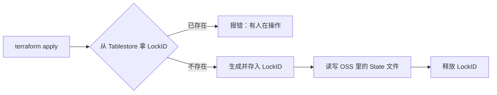

+++
date = '2026-09-04T16:08:53+08:00'
draft = false
title = 'Terraform 状态文件管理'
categories = ['Terraform']
tags = ['IaC', '基础设施', 'Cloud', '阿里云']
+++

# 1. 为什么要把 State 搬到「云上」

State 文件是 Terraform 的「账本」：它记录云上到底有哪些资源、各自的属性。本地存放 State 有三个硬伤：

- 绑定机器：State 在 A 电脑上，B 电脑 apply 就会"失忆"，容易把资源重建一遍。
- 无法协作：两个人同时改同一个环境，互相覆盖，状态文件乱套。
- 安全隐患：本地文件易丢，而且里面可能含有明文密码等敏感信息，因此也不建议上传到 gitlab 等代码托管平台。

解决办法就是 Terraform 的 **Backend 机制**：**用阿里云 OSS 存 State（集中、加密、可回滚），用 Tablestore 提供加锁（防止多人并发操作冲突）**。

# 2. 工作原理

每次执行 Terraform 命令，OSS Backend 都会走「加锁 → 干活 → 放锁」三步：



- **有锁** → 说明有人正在操作，或上次操作异常退出，直接报错
- **无锁** → 自动生成 LockID 存入 Tablestore，操作完成后更新 OSS 中的 State，再释放锁

# 3. 第一步：创建「存储 + 锁」资源

在正式使用前，要先准备一个 OSS Bucket 和一个 Tablestore 实例/表。它们本身也是云资源，所以也可以用 Terraform 自己建。

需要注意的是，**下面这段代码要用一个单独项目来创建**（否则就成了"先有鸡还是先有蛋"）。

新建一个 `bootstrap/` 目录，内容如下：

```hcl
# bootstrap/main.tf —— 一次性创建「State 存储 + 锁」资源
# 注意：本目录使用本地单独项目，不依赖它自己创建的资源

terraform {
  required_version = ">= 1.5.0"
  required_providers {
    alicloud = {
      source  = "aliyun/alicloud"
      version = "~> 1.289"
    }
  }
}

variable "region" {
  default = "cn-shanghai"
}

provider "alicloud" {
  region = var.region
}

# OSS Bucket：存放所有 State 文件
resource "alicloud_oss_bucket" "state" {
  bucket = "tf-state-demo-wuvikr" # 全局唯一，改成你自己的

  server_side_encryption_rule { # 服务端加密
    sse_algorithm = "AES256"
  }

  versioning { # 版本控制，误删可回滚
    status = "Enabled"
  }
}

# acl 字段在 provider 1.220 起已废弃，改用独立资源设置私有访问
resource "alicloud_oss_bucket_acl" "state" {
  bucket = alicloud_oss_bucket.state.bucket
  acl    = "private"
}

# Tablestore 实例：提供加锁服务
resource "alicloud_ots_instance" "lock" {
  name        = "tf-lock"
  description = "Terraform state lock"
}

# 等待 Tablestore 实例的 endpoint DNS 生效
resource "time_sleep" "wait_for_ots_dns" {
  depends_on      = [alicloud_ots_instance.lock]
  create_duration = "60s"
}

# 锁表：主键必须叫 LockID，类型 String（硬性要求）
resource "alicloud_ots_table" "lock" {
  depends_on = [time_sleep.wait_for_ots_dns]  # 建表等 DNS
  instance_name = alicloud_ots_instance.lock.name
  table_name    = "terraform_lock" # 表名只能含字母/数字/下划线
  time_to_live  = -1
  max_version   = 1

  primary_key {
    name = "LockID"
    type = "String"
  }
}

```

执行：

```bash
cd bootstrap
export ALICLOUD_ACCESS_KEY=xxx
export ALICLOUD_SECRET_KEY=xxx
terraform init && terraform apply
```

> 嫌麻烦也可以直接在控制台/命令行创建：一个私有 OSS Bucket + 一个 Tablestore 表（主键 `LockID` / `String`），效果一样。

# 4. 第二步：把项目后端切到 OSS

回到你真正的 Terraform 项目，在根目录加一个 `backend.tf`：

```hcl
# backend.tf
terraform {
  backend "oss" {
    bucket  = "tf-state-demo-wuvikr"
    key     = "prod/terraform.tfstate"
    region  = "cn-shanghai"
    encrypt = true

    # 加锁配置：Tablestore
    tablestore_endpoint = "https://tf-lock.cn-shanghai.ots.aliyuncs.com"
    tablestore_table    = "terraform_lock"
  }
}
```

关键参数一览：

|         参数          |                             作用                             |
| :-------------------: | :----------------------------------------------------------: |
|       `bucket`        |                    OSS Bucket 名（必填）                     |
|         `key`         |      State 文件的存放路径，如 `prod/terraform.tfstate`       |
|       `region`        |                       Bucket 所在区域                        |
|   `encrypt` / `acl`   |                    服务端加密 / 私有访问                     |
| `tablestore_endpoint` | Tablestore 实例访问地址，格式 `https://<实例名>.<区域>.ots.aliyuncs.com` |
|  `tablestore_table`   |                    锁表名（主键 LockID）                     |

然后迁移本地 State：

```bash
terraform init -migrate-state   # 把本地 terraform.tfstate 拷到 OSS
terraform plan
terraform apply
```

> 之后所有队友 clone 项目后，只要 `terraform init`（会自动识别 backend），就能读写同一份远程 State。

# 5. 第三步：测试加锁是否正常运行

现在开**两个终端**，同时对同一份配置执行 `terraform apply`：

- 终端 A：正常执行
- 终端 B：会卡住或直接报错，提示锁被占用

报错大概长这样：

```
Error: Error acquiring the state lock

Lock Info:
  ID:        a1b2c3d4-...
  Operation: OperationTypeApply
  Who:       zhangsan
  Created:   2026-09-03 17:30:00
```

**场景一：正常等锁。** 希望 B 等 A 跑完再继续，加超时参数：

```bash
terraform apply -lock-timeout=5m   # 最多等 5 分钟
```

**场景二：处理"僵尸锁"。** 如果某人的 apply 中途电脑死机/断网，锁不会被自动释放。确认**没有其他人正在执行**后，手动解锁：

```bash
terraform force-unlock a1b2c3d4-...   # 解锁 ID 在报错信息里
```

> ⚠️ `force-unlock` 是危险操作：**一定先确认当前没有任何人在跑 plan/apply**，否则会破坏 State 一致性。

# 6. 最佳实践

**1. 按环境/项目隔离 State**：`key` 用不同路径

```
prod/terraform.tfstate
dev/terraform.tfstate
```

**2. 加密 + 版本控制**：`encrypt = true`，Bucket 开启版本控制，防止误删、可回滚。

**3. 最小权限**：普通开发只读 State，写权限只给 CI/CD 角色。示例 RAM 策略：

```json
{
  "Version": "1",
  "Statement": [
    {
      "Effect": "Allow",
      "Action": ["oss:GetObject", "oss:ListObjects", "oss:GetBucketInfo"],
      "Resource": ["acs:oss:*:*:my-team-tf-state", "acs:oss:*:*:my-team-tf-state/*"]
    },
    {
      "Effect": "Allow",
      "Action": ["ots:GetRow", "ots:PutRow", "ots:DeleteRow"],
      "Resource": ["acs:ots:*:*:instance/tf-lock/table/terraform-lock"]
    }
  ]
}
```

> OTS 的 Resource 格式请以 RAM 控制台实际提示为准。

**4. 密钥不写进代码**：AccessKey 用环境变量或 shared credentials profile，绝不明文写在 `.tf` 里。

**5. 锁超时设合理值**：CI 里建议 `-lock-timeout=10m`，避免锁冲突直接失败。

**6. 永远不要手改 OSS 里的 State 文件**：需要改状态用 `terraform state` 系列命令。

**7. 跨项目读状态**：需要读取其他项目的输出时，用 `terraform_remote_state`：

```hcl
data "terraform_remote_state" "vpc" {
  backend = "oss"
  config = {
    bucket = "my-team-tf-state"
    key    = "network/terraform.tfstate"
    region = "cn-hangzhou"
  }
}
```

**8. 谨慎 force-unlock**：只在你确认"没有正在跑的 apply"时使用。

# 7. 参考文档

- 阿里云：五分钟入门 Terraform OSS Backend —— https://help.aliyun.com/zh/terraform/five-minute-introduction-to-alibaba-cloud-terraform-oss-backend
- Terraform 官方：OSS Backend 配置说明 —— https://registry.terraform.io/providers/aliyun/alicloud/latest/docs/guides/remote-state
