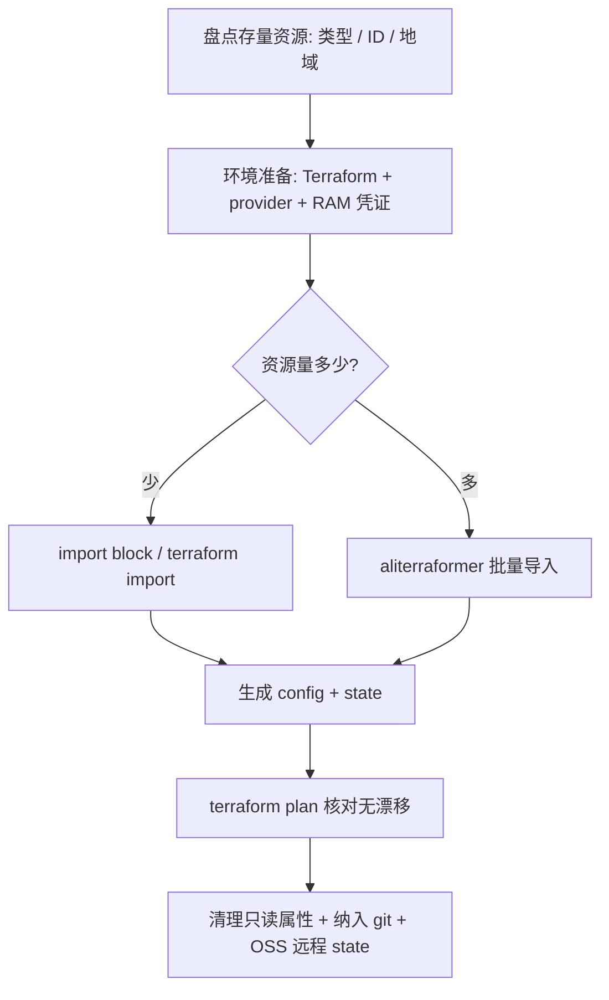

+++
date = '2026-09-03T16:24:03+08:00'
draft = false
title = '云上存量资源管理'
categories:
  - Terraform
tags:
  - IaC
  - 基础设施
  - Cloud
+++

# 1. 为什么要"导入"云上资源？

很多团队都有这样的经历：最开始用控制台点几下、或者用 CLI 脚本把资源建好了，等资源越攒越多、想标准化管理时，发现这些资源"游离"在 Terraform 之外。

Terraform 的管理逻辑很简单：**它只认自己 state 文件里记录的资源**。你在控制台创建的资源，Terraform 根本"看不见"，也不会去动它们。所以要把存量资源管起来，第一步就是"导入"（import）——把云上已有的资源登记进 Terraform 的 state，再补上对应的配置代码。

导入成功后，这些资源和 Terraform 新建的资源享受完全一样的待遇：能 plan、能 apply、能 diff、能进 CI/CD。

# 2. 先搞清楚两个概念：config 和 state

这是最容易绕晕的地方，务必先分清：

|               概念               |                       是什么                       |           谁来写           |
| :------------------------------: | :------------------------------------------------: | :------------------------: |
|     **`.tf` 配置（config）**     |        声明"想要什么"，是给人看的声明式代码        |    手写，或工具自动生成    |
| **`terraform.tfstate`（state）** | 记录"现在实际是什么"，含真实属性（可能有敏感信息） | 由 apply / import 自动生成 |

关键点：

- **导入只会写 state，不会自动写 config**（除非你用 `-generate-config-out` 或 Terraformer）。
- 所以完整流程 = **导入进 state + 补齐 config + plan 核对一致**，三步缺一不可。
- state 含敏感信息，**永远不要提交到 git**（后面最佳实践会讲远程存储）。

整体流程可以先看这张图：



# 3. 三种导入方式怎么选

[阿里云官方文档](https://help.aliyun.com/zh/terraform/import-resources-into-terraform#63744434ecsis)提供了三种方式，直接放对比表：

| 方式                                     | 优势                                              | 不足                  | 适用场景            |
|:--------------------------------------:|:-----------------------------------------------:|:-------------------:|:---------------:|
| `terraform import` 命令                  | 简单直接，单条命令即可                                     | 一次只能导一个，config 要自己写 | 单资源、修复漂移        |
| **import block**（Terraform ≥1.5）       | 支持批量，`-generate-config-out` 能**自动生成配置**         | 批量时配置成本较高           | 少量到中等资源，**首选**  |
| **aliterraformer**（阿里云增强版 Terraformer） | 按产品 / 标签 / 资源组过滤，**批量生成 config + state + 依赖关系** | 需要额外下载工具            | 资源多、整体兜底，**首选** |

> ⚠️官方还提供 IaC 服务（[自动化服务台](https://iac.console.aliyun.com/exporttasks)），在控制台里就能做"存量资源导入 / 批量逆向导出"，适合不想敲命令、或需要团队托管的人。

# 4. 环境准备（一次性）

以 macOS 为例：

```bash
# 1) 安装 Terraform
brew install terraform

# 2) 建工作目录
mkdir tf-aliyun && cd tf-aliyun

# 3) 配置凭证：建议用 RAM 子账号 + 只读权限
export ALICLOUD_ACCESS_KEY="LTAI..."
export ALICLOUD_SECRET_KEY="..."
export ALICLOUD_REGION="cn-shanghai"
```

```hcl
# provider.tf
terraform {
  required_providers {
    alicloud = {
      source  = "aliyun/alicloud"
      version = "~> 1.239.0"
    }
  }
}

provider "alicloud" {
  region = "cn-shanghai"
}
```

# 5. 方式一：terraform import 命令（单资源）

```hcl
# main.tf —— 先建一个空资源块占位
resource "alicloud_oss_bucket" "this" {
}
```

```bash
terraform import alicloud_oss_bucket.this my-existing-bucket
terraform show    # 查看导入的真实属性，手动回填进 main.tf（去掉只读字段）
```

优点简单，缺点是要手动找资源 ID、手动写代码，资源一多效率就非常低下。

# 6. 方式二：import block（适合单个项目，少量资源）

Terraform 1.5 开始支持在配置里写 import 块，最大的好处是能**自动生成配置**：

```hcl
# main.tf —— 只写 import 块，资源 ID 从控制台拿
import {
  to = alicloud_oss_bucket.this
  id = "my-bucket-tftest"
}

import {
  to = alicloud_security_group.sg_3
  id = "sg-uf6ftgdwv2nmtq66k4nu"
}
```

```bash
terraform init
terraform plan -generate-config-out=generated.tf   # 自动生成配置并预览导入
# 检查 generated.tf，删掉只读属性（如 creation_date / owner 等）
terraform apply                                    # 确认导入
```

多资源就多写几个 import 块，还能用 `for_each` 批量（注意：使用 `for_each` 时不能用 `-generate-config-out`，两者互斥）。

# 7. 方式三：aliterraformer 批量导入（资源多的情况）

```bash
# macOS arm64 下载安装
wget https://terraform-share.oss-cn-hangzhou.aliyuncs.com/aliterraformer/aliterraformer_darwin_arm64.zip
unzip aliterraformer_darwin_arm64.zip && chmod +x aliterraformer && sudo mv aliterraformer /usr/local/bin/

# 查看支持导入的产品和资源
aliterraformer products
aliterraformer resources -p VPC

# 导入指定区域全部 VPC / VSwitch / ECS（可加 --filter 按标签 / 资源组过滤）
mkdir import-out && cd import-out
aliterraformer import alicloud --regions=cn-hangzhou -r=vpc,vswitch,instance --path-pattern={output} --compact
```

生成的目录结构（默认按服务分文件）：

```text
.
├── outputs.tf
├── provider.tf
├── resources.tf      # 指定 --compact 时所有资源合到一个文件
├── terraform.tfstate
└── variables.tf
```

# 8. 实战踩坑

## 8.1. OSS 区域不匹配报错

导入 OSS 时，`terraform plan` 报了这个错：

```text
Error: Resource xxx GetBucketCORS Failed!!!
StatusCode=403, ErrorCode=AccessDenied,
ErrorMessage="The bucket you are attempting to access must be addressed
using the specified endpoint. Please send all future requests to this endpoint."
Endpoint=oss-cn-shanghai.aliyuncs.com
```

**原因**：这是 OSS 经典的"区域不匹配"（PermanentRedirect）报错，错误码 `0003-00001403`。你 provider 里配置的 region **和桶实际所在地域不一致**，OSS 要求你用正确的 endpoint 访问。注意这不是权限问题——权限不足会是另一种报错文案。

**解决**：

1. 查桶实际地域：OSS 控制台 → 桶的**概览页**看"外网访问 Endpoint"（例如 `oss-cn-hangzhou.aliyuncs.com` 就代表 `cn-hangzhou`）；或命令行 `ossutil stat oss://<bucket名>`。
2. 把 provider 的 region 改成桶所在地域：

```hcl
provider "alicloud" {
  region = "cn-hangzhou"   # 改成桶实际地域
}
```

3. 重新 `terraform plan -generate-config-out=generated.tf`。

**进阶**：如果其他资源在一个 region、只有这个桶在别的 region，同一个目录里用 alias provider 混地域：

```hcl
provider "alicloud" {
  region = "cn-shanghai"
}

provider "alicloud" {
  alias  = "oss"
  region = "cn-hangzhou"   # 桶所在地域
}

import {
  to       = alicloud_oss_bucket.default
  id       = "wuvikr-tf"
  provider = alicloud.oss
}
```

## 8.2. aliterraformer 找不到 provider 插件

跑 aliterraformer 时报：

```text
open /Users/xxx/.terraform.d/plugins/darwin_arm64: no such file or directory
```

**原因**：aliterraformer 启动时要加载 alicloud provider 插件（`terraform-provider-alicloud` 二进制），它会去 `.terraform`、`~/.terraform.d/plugins` 里找。机器上该目录不存在，所以直接退出了。

**解决**：在**运行 aliterraformer 的目录**先 `terraform init`，把 provider 装进该目录的 `.terraform/`：

```bash
mkdir -p import-out && cd import-out

cat > provider.tf <<'EOF'
terraform {
  required_providers {
    alicloud = {
      source  = "aliyun/alicloud"
      version = "~> 1.239.0"
    }
  }
}
provider "alicloud" {
  region = "cn-shanghai"
}
EOF

terraform init
# 确认 AK/SK 环境变量还在（新开终端会丢）
export ALICLOUD_ACCESS_KEY="LTAI..."
export ALICLOUD_SECRET_KEY="..."

aliterraformer import alicloud --regions=cn-shanghai -r=vpc,vswitch,instance --path-pattern={output} --compact
```

新开终端后环境变量丢失、或换了目录没重新 init，是这类问题的高频来源。建议用 profile 或密钥管理保存 AK，别把密钥硬编码进命令历史。

## 8.3. 两个 state 版本不一样，怎么合并？

你可能会遇到这种情况：一个 state 是 aliterraformer 生成的（`"version": 3`，Terraform 0.12 格式），另一个是 `terraform import` 生成的（`"version": 4`，Terraform 1.5 格式）。问：怎么合成一个？

**结论：千万不要手动拼 JSON。**

- `version: 3` 是 0.12 时代的嵌套结构（`modules[].resources[].primary.attributes`）；
- `version: 4` 是 1.x 的扁平结构（`resources[].instances[].attributes`）；
- 两者字段结构完全不同，手拼必然损坏 state，一旦 apply 可能误删云上资源。

**新版 Terraform 能自动读取并升级旧格式 state**，所以格式本身不是障碍。真正要处理的是 provider 地址（旧 state 里可能是 `registry.terraform.io/-/alicloud` 这种旧写法）。

推荐做法有两种：

1. **不合并，直接重新导入：**

如果资源量少（比如就几个安全组），在目标工作区重新 import 比合并旧 state 干净得多，最后只有一个统一的新格式 state：

```hcl
import {
  to = alicloud_security_group.sg_1
  id = "sg-uf6ci50n3a0ca474s4xm"
}
# 其余资源同理
```

```bash
terraform plan -generate-config-out=generated_sg.tf
terraform apply
terraform plan   # 应显示 No changes
```

2. **用 terraform state mv 真合并：**

官方提供 `terraform state mv`，能把资源从旧 state 搬到主 state（还能顺带改名）：

```bash
# 0) 备份（务必）
cp terraform.tfstate terraform.tfstate.bak

# 1) 逐条搬入：-state=源(旧) -state-out=目标(主)
terraform state mv \
  -state=aliterraformer.tfstate \
  -state-out=terraform.tfstate \
  'alicloud_security_group.sg-uf6ci50n3a0ca474s4xm' \
  'alicloud_security_group.sg_1'

# 2) 修正旧 state 的 provider 地址
terraform state replace-provider -auto-approve "registry.terraform.io/-/alicloud" "aliyun/alicloud"
```

**注意**：aliterraformer 会把资源名直接取成资源 ID（如 `sg-uf6ci50n3a0ca474s4xm`），**带连字符不是合法的 Terraform 配置标识符**（配置里资源名只能字母数字下划线），所以合并时要用 `state mv` 顺带改成 `sg_1` 这种合法名字。

## 8.4. ECS 导入时生成配置报一堆错

VPC / VSwitch / 安全组 / OSS 都导入成功后，轮到 ECS 时，`terraform plan -generate-config-out=generated.tf` 报了一连串 Error，而且全都指向 `generated.tf` 里的 `alicloud_instance`：

```text
Error: "subnet_id": [REMOVED] Field 'subnet_id' has been removed from version 1.210.0
Error: "secondary_private_ip_address_count": conflicts with secondary_private_ips
Error: "secondary_private_ips": conflicts with secondary_private_ip_address_count
Error: expected http_put_response_hop_limit to be in the range (1 - 64), got 0
Error: "ipv6_addresses": conflicts with ipv6_address_count
Error: "ipv6_address_count": conflicts with ipv6_addresses
```

**原因**：这些错误**全部来自"自动生成的配置本身不合法"**，不是导入失败，更不是云上资源有问题。`-generate-config-out` 是实验功能，会把 API 返回的**所有属性全量 dump 成配置**，而 `alicloud_instance` 的 schema 非常大，包含大量互斥的计算字段和已废弃字段。

逐个拆解：

|                             报错                             |                     原因                      |              处理               |
| :----------------------------------------------------------: | :-------------------------------------------: | :-----------------------------: |
|                      `subnet_id` 已移除                      | 字段改名成 `vswitch_id`，生成器 dump 出旧字段 | 删 `subnet_id`，用 `vswitch_id` |
| `secondary_private_ip_address_count` 与 `secondary_private_ips` 冲突 |              互斥字段被同时写入               |  只留一个，没配辅助 IP 就全删   |
|        `ipv6_address_count` 与 `ipv6_addresses` 冲突         |                     同上                      |   只留一个，没配 IPv6 就全删    |
|       `http_put_response_hop_limit` 范围 1-64，给了 0        |     API 返回 0 表示"未设置"，schema 不认      |           删掉该字段            |

**解决（推荐）**：复杂资源别用自动生成，改成"手写最小配置 + import + plan 对齐"：

1. 删掉有问题的 `generated.tf`：

   ```bash
   rm generated.tf
   ```

2. 手写一个最小 resource 块，只写真正想纳管的属性：

   ```hcl
   resource "alicloud_instance" "ecs_default" {
     instance_name   = "你的实例名"
     vswitch_id      = "vsw-xxxxxxxx"
     security_groups = ["sg-xxxxxxxx"]
     image_id        = "你的镜像ID"
     instance_type   = "你的规格"
     # 其余属性先不写，交给 plan 对齐
   }
   ```

3. 去掉 `-generate-config-out` 直接 plan / apply 完成导入：

   ```bash
   terraform plan
   terraform apply
   ```

4. 用 `terraform state show alicloud_instance.ecs_default` 查看真实属性，把想管理的字段回填进配置。

5. 再次 `terraform plan`：出现的字段差异是正常的，逐个决定纳入管理，或用 `lifecycle { ignore_changes = [...] }` 忽略。

**备选**：坚持用自动生成的话，手动把 `subnet_id`、`secondary_private_ip_address_count/ips`、`ipv6_address_count/addresses`、`http_put_response_hop_limit` 这几个字段从 `generated.tf` 删掉再 plan，但不推荐。

**总结**：`-generate-config-out` 只适合字段简单清晰的资源（OSS、VPC、VSwitch）；对 ECS 这种大 schema 资源，手写最小配置才是标准做法。报错里提示的 `TF_SKIP_RESOURCE_SCHEMA_VALIDATION=true` 只是把错误降级成警告的兜底开关，会掩盖配置问题，不建议使用。

# 9. 最佳实践清单

1. **RAM 最小权限**：导入只需要只读权限，别用主账号 AK/SK。

2. **导入顺序有讲究**：先基础网络（VPC → VSwitch → 安全组），再上层（ECS / RDS / SLB），避免属性引用断链。

3. **apply 前必看 plan**：`terraform plan` 应显示 `No changes`；如果出现 `will be destroyed`，说明配置与现状不一致（比如把只读属性写成了参数），**先对齐再 apply**，否则会删云上资源。

4. **只读属性要删掉**：`-generate-config-out` 生成的配置里会有 `creation_date`、`owner` 这类只读字段，必须从 config 里删掉，否则 plan 永远有 diff。

5. **state 绝不进 git**：state 含敏感信息，必须用远程 backend 存储。阿里云用 OSS backend 并开启加密：
   
   ```hcl
   terraform {
     backend "oss" {
       bucket  = "my-tf-state-bucket"
       key     = "prod/terraform.tfstate"
       region  = "cn-hangzhou"
       encrypt = true
     }
   }
   ```

6. **操作前备份 state**：合并、迁移、删除资源前，先 `cp terraform.tfstate terraform.tfstate.bak`。

7. **配置进 git、变更走评审**：`.tf` 纳入版本管理，AK/SK 用变量 + 密钥管理，CI 里跑 plan 做变更门禁。

8. **敏感值脱敏**：密码、密钥类属性不要硬编码在配置里。

9. **旧 state 记得 replace-provider**：用 Terraformer 系列生成的 state，provider 地址可能是旧格式，跑一次 `terraform state replace-provider -auto-approve "registry.terraform.io/-/alicloud" "aliyun/alicloud"`。

10. **资源名要合法**：资源名只能字母数字下划线，别直接拿带连字符的资源 ID 当名字。
